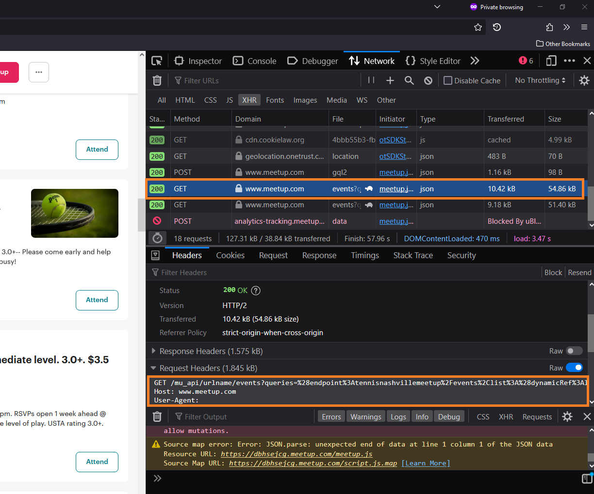
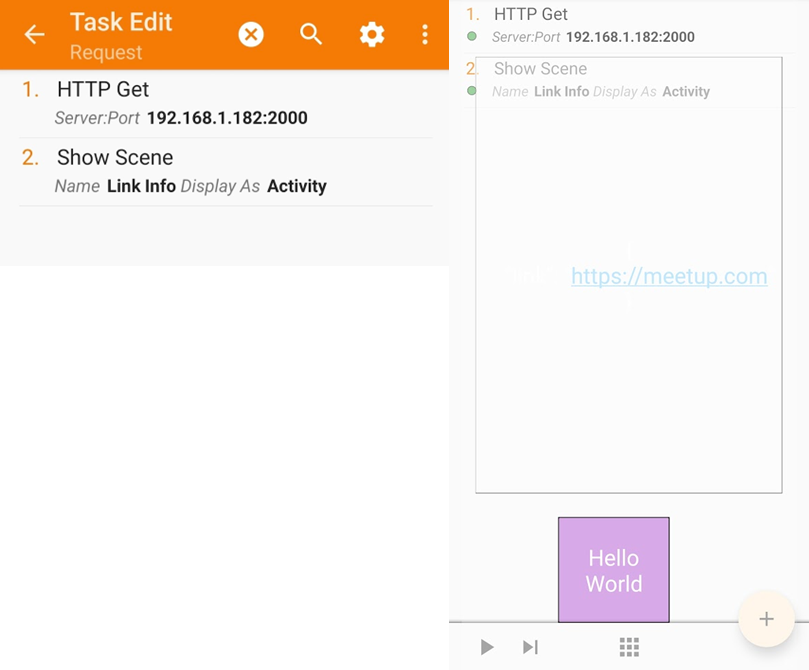

+++
title = 'ChatGPT x Tennis - a weekend hacking project'
date = '2023-08-20T14:29:52-05:00'
description = "Using ChatGPT as my coding assistant to help me play more tennis"
tags = []
categories = ["developer"]
link = ""
hasequations = false
includes = []       # any javascript files to include
tableofcontents = true
draft = false
+++

I ~~like~~ love playing tennis. One tennis event I go to is very popular. It gets posted online a week ahead, at a random time late in the morning. Within an hour of the post going online, all spots are taken up. I want to play every week.

My current solution is to rely on a carefully cultivated clique of confidants who will text me when the next event is up.

It works sometimes.

## Problem & Approach

I want it to work every time. I want to be notified as soon as the event is up so I can put my name in. Now, the website the event is hosted on has a paid Pro subscription. It will notify me when events are up. They also have a paid developer API which I can use to automatically RSVP to an event.

But why spend 5 dollas on the Pro or Developer features? I can save that money for my retirement account, and instead spend 5 hours of my PhD-having billable hours on solving this. Right?

This was my approach:

1. Extraction: parse website for my event information
2. When the desired event is up, notify me with the link promptly
3. Once I get the link, I will manually add myself to the event
    1. I could use libraries like puppeteer to automate logging in an clicking on "Attend" button, but I figured that was too much work
4. Run (1,2) only during fixed times every week

## Extraction

### Attempt 1 - scraping

My first thought was to write a website scraper that can parse the DOM (document object model) for the event card. I faintly remember being able to use `beautifulsoup4` for that. But, I'd forgotten. So, I asked ChatGPT for help:

> *Me*:  What is python code to get HTML code of a web page?  
> *ChatGPT*: You can use the `requests` library in Python to retrieve the HTML code of a web page. Here's an example of how you can do it:

```python
import requests

url = "https://example.com"  # Replace with the URL of the web page you want to fetch

try:
    response = requests.get(url)
    html_code = response.text
    print(html_code)
except requests.exceptions.RequestException as e:
    print("Error: ", e)
```

> *Me*: How to parse this HTML to find a div element containing the text "TEXT"  
> *ChatGPT*: To parse HTML and find a `<div>` element containing the text "TEXT," you can use the BeautifulSoup library in Python. Here's an example that builds upon the previous code snippet:

```python
import requests
from bs4 import BeautifulSoup

url = "https://example.com"  # Replace with the URL of the web page you want to fetch

try:
    response = requests.get(url)
    html_code = response.text
    
    # Create a BeautifulSoup object to parse the HTML
    soup = BeautifulSoup(html_code, 'html.parser')
    
    # Find the <div> element containing the text "TEXT"
    div_element = soup.find('div', text="TEXT")
    
    if div_element:
        print(div_element)
    else:
        print("Div element with text 'TEXT' not found.")
        
except requests.exceptions.RequestException as e:
    print("Error: ", e)
```

> *Me*: How to find a div element only using part of the text? For example, if the div contains "This is text", how to find that div using only "is text" for query  
> *ChatGPT*: To find a `<div>` element based on a partial text match, you can use a lambda function with the `text` parameter in BeautifulSoup. Here's an updated example that demonstrates how to achieve this:

```diff
- # Find the <div> element containing the text "TEXT"
- div_element = soup.find('div', text="TEXT")
+ # Find the <div> element with partial text match
+ div_element = soup.find('div', text=lambda text: text and partial_text in text)
```

> *Me*: How to find multiple div elements with the same text?  
> *ChatGPT*: To find multiple `<div>` elements with the same text, you can use the `find_all()` method in BeautifulSoup. Here's an example that demonstrates how to accomplish this:

```diff
- # Find the <div> element with partial text match
- div_element = soup.find('div', text=lambda text: text and partial_text in text)
+ # Find all <div> elements with the target text
+ div_elements = soup.find_all('div', text=lambda text: text and partial_text in text)
```

So now, my code looks like this:

```python
import requests
from bs4 import BeautifulSoup

# Parse website for data
def find(response, text):
    soup = BeautifulSoup(response.text, 'html.parser')
    div_element = soup.find_all('a', string= lambda s: (s and text in s))
    if len(div_element) > 0:
        return div_element[-1]
    return False

url = 'URL_OF_PAGE_WITH_EVENTS'
response = requests.get(url)
my_event_link = find(response, 'EVENT NAME')

# Send notification if it is available
if my_event_link:
    pass
```

There are two issues. (1) This returns the `<a>` element containing the link to my event. It is fine, but I will need to parse the HTML to get more details (for e.g. whether it is cancelled, and how many are already signed up to go etc.)

And (2). I cannot find my event.

### Attempt 2 - querying

See, the website's DOM is not static. When I load the page, it only shows the next 10 events. Scrolling to the page end triggers more events to load. When I look a week ahead, I usually have to scroll to the end of the page once, wait for more events to load, and then find the link to my event.

Hmm. So there are network requests being made which dynamically load new events. Can I get data directly from them?



Yes, I can! By opening the developer console (`Ctrl+Shift+I`), refreshing the page, and scrolling until a load of events is triggered, I can pinpoint the `GET` request being made. The response is a JSON object, which I can parse using python's `json.loads()` function.

The `GET` request is made with several parameters. They include the time window and the fields in the requested payload. Therefore, I can only ask for the events during the time I am interested in, and only the information I need. This will save the website server unnecessary bandwidth.

So now, my code looks like this:

```python
import requests
import json
from datetime import datetime, timedelta
import pytz

tz = pytz.timezone('US/Central')

def get_request() -> str:
    """Construct the request URL to get the JSON for my event"""
    # The starting time for the search.
    # The event is announced a week in advance.
    # So, 6 days and 20 hours ahead approximately
    since = (tz.localize(datetime.now()) + timedelta(days=6)).isoformat()
    # Number of events since the starting time.
    # This is more than enough. My event is first or second in the list.
    n = 5
    # This is the URL I got by inspecting network requests, where I can
    # plug desired parameters:
    url = (f"https://www.WEBSITE.com/"
    f"....blah blah blah..."
    f"page:'{n}',scroll:'since:{since}',"
    f"... blah blah blah...")
    return url

# get the HTML response
def get_event_info(search_query: str) -> dict:
    response = requests.get(url=get_request())
    # parse that as JSON, and turn it into a python dictionary.
    # the parsed dictionary has a nested structure, which I
    # index to get the relevant information.
    # The payload from the JSON is a list of dictionaries,
    # each containing event information
    payload = json.loads(response.text)['responses'][0]['value']
    # Sample output
    for event in payload:
        if event['name'].startswith(search_query):
            return event
    return {}
```

## Notification

Ok. I have the list of events, and the event I am interested in. Fine. How do I notify myself when that new event is up?

### Attempt 1 - Tasker

I note that I am usually at home after tennis, during the time when this goes up. I can set up a local server which will serve me this information.

Alright, I can use python's build-in `http.server`. I've dabble with that before; I can make it work. But, how do I actually notify myself that there is new information available? I can make my phone query the server at intervals until I have the event link.

I can use [Tasker](https://tasker.joaoapps.com/)! I had paid for this application on a whim using my [Google Opinion Rewards](https://support.google.com/opinionrewards/answer/7378183?hl=en) dollas. Now is the time to shine! Tasker is an application that "performs _tasks_ (sets of actions) based on _contexts_ (application, time, date, location, event, gesture) in user-defined profiles or in clickable or timer home screen widgets."

So, I can set up a Tasker *Action* to query my local server at a certain interval and pop up a widget with the resulting information. The images below show the task setup, and how the widget looks:



Now, the server. I ask ChatGPT for a script to run a HTTP server and serve a string response. Some changes later, I get the following snippet. The server will run for *only* one request. It will serve the URL of the event RSVP page, and then quit.

```python
from http.server import HTTPServer, BaseHTTPRequestHandler
import threading

def make_server(event: dict, port: int=8000):
    class HTMLResponseHandler(BaseHTTPRequestHandler):

        def do_GET(self):
            # Set response status code to 200 (OK)
            self.send_response(200)
            # Set response headers
            self.send_header('Content-type', 'text/html')
            self.end_headers()
            # Send the HTML content as the response
            self.wfile.write(event['link'].encode('utf-8'))
            # After serving the URL once, shut down the server
            # We need a separate thread for this, because calling `shutdown`
            # from the same thread as server will cause deadlock.
            th = threading.Thread(target=self.server.shutdown, daemon=True)
            th.start()

    httpd = HTTPServer(('0.0.0.0', port), HTMLResponseHandler)
    httpd.serve_forever()
```

I am feeling not quite entirely pleased. This setup is clunky. I have to run a server *and* I have to be on my home network *and* I have to set up an Android widget to notify me.

### Attempt 2 - Email

Why not just use email? I won't be tied to my home network. And, my mobile email client already knows to send me notifications for new messages.

I know I can use python's `smtp` and `email` libraries to connect to email servers and compose messages. I think connecting to a Gmail account may be tricky. I have two factor authentication set up. A few web searches later, I know the answer. [Google lets me set up an app-specific password.](https://support.google.com/accounts/answer/185833) Consider it an API key. I can use that to log into my email and send myself a message.

```python
import os
from email.message import EmailMessage
import smtplib

def send_email(event: dict):
    # The credentials are stored as environment variables, so I do not have
    # to hard code them into my script
    pwd = os.environ.get('EMAIL_PWD')
    from_addr = os.environ.get('EVENT_FROM_EMAIL')
    to_addr = [os.environ.get('EVENT_TO_EMAIL')]

    try:
        server = smtplib.SMTP_SSL('smtp.gmail.com', 465)
        server.ehlo()
        server.login(from_addr, pwd)
        text = \
        (f"{event['name']} is up!\n\n"
         f"Link: {event['link']}")
        msg = EmailMessage()
        msg.set_content(text)
        msg['From'] = from_addr
        msg['To'] = to_addr
        msg['Subject'] = f"{event['name']} is Up!"
        server.send_message(msg, from_addr, to_addr)
        server.close()
    except Exception as exc:
        print(exc)
```

Great! I now have two options to get my event information. Some clobbering later, I have combined everything into a python script. I won't repeat myself, but the pseudo code looks like this:

```
Use python's argparse.ArgumentParser to set up some command line options for:
    event search query
    query interval
    notification method (email/server)
    stop time

while not stop time:
    event = get_event(search query)
    if not event:
        sleep for query interval

if event:
    if notification via email:
        send_email(event)
    else:
        make_server(event)
```

## Automation

Finally, automation. How do I make the script run at specific times of the week? I will use [Cron](https://en.wikipedia.org/wiki/Cron) jobs. Cron is a handy utility on GNU/Linux which can run commands at intervals. All it takes is to specify in the `crontabs` file as:

```bash
minute hour  day month weekday <command-to-execute>
0      11    *   *     6       . $HOME/.profile; python3 myscript.py 'MY EVENT NAME'
```

This entry makes `python myscript.py` run on every Saturday at 11am. I set the Gmail application password and email addresses as environment variables. So first, I run my user's `.profile`, before my python script is able to run.

I deploy this on a Raspberry Pi 3 that I've been running as a little lab server.

Et viola! I test it with an event and I get an email!

## Thoughts

This project was the brainchild of my desire to attend my favorite tennis event. I used it to test out instruction-tuned large language models as productivity aids. The results were good, but with a grain of salt.

On one hand, I like that I am able to scaffold the code I eventually want written. Sometimes, ChatGPT will use libraries I haven't heard of. Sometimes, it will suggest a course of action I hadn't thought of. (For example, it used the `sched` library to schedule the HTTP server shutdown after it had served the event URL.) These were all learning experiences.

Ultimately, however, I am the conductor. I was responsible for orchestrating my solution. ChatGPT distinguished itself helping me scrape the website for text. But, it was my experience with wrangling network requests that helped me pivot towards my second attempt. Similarly, ChatGPT happily wrote away the perfect HTTP server. But, it was my evaluation of pros/cons of the server-android widget setup that  let me to a more elegant email-based solution.
