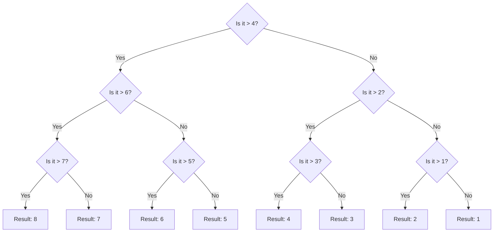

+++
title = "Surprise? A derivation of entropy"
date = "2025-12-04T22:07:36-08:00"
description = "I explain entropy to myself"
link = ""
tags = [ ]
categories = [ ]
includes = [ ]
hasequations = true
tableofcontents = false
draft = false
slug = "surprise-derivation-entropy"
+++

🚧Work in progress🚧

In this post, I will derive entropy from first principles. This requires no more than a high school-level understanding of mathematics. This derivation is based on Shannon's original seminal paper, [*A mathematical theory of communication*](https://people.math.harvard.edu/~ctm/home/text/others/shannon/entropy/entropy.pdf).

## A derivation

We want a function, $H(n)$, which measures the uncertainty in a system in which we chose one of $n$ events that can occur. We would want it to exhibit the following three properties:

1. Continuity. If the probability of an event changes slightly, the measure of uncertainty in our choice should not suddenly jump.

2. Monotonicity. If the amount of possible events that can happen in the system increases, so does the measure of uncertainty in our choice. The uncertainty in a roll of a coin ($1/2$) is smaller than the uncertainty in a  roll of a die ($1/6$) which is smaller than the uncertainty of drawing a card from a deck ($1/52$).

3. Additivity. If choice from events can be broken up into multiple choices, then the uncertainties of the parts should add up to the uncertainty of the system. The uncertainty of choosing a card from the deck is the same as the uncertainty of choosing the suit ($1/4$) and then the number on the card ($1/13$).

Let's say there are $n$ events that can happen, equally likely, and we observe them once. We use the measure $H(n)$ to denote the uncertainty in the system.

Now, let's say add to the system and call it system2. There are $n$ possible events that can happen in the original system. System2 is composed of $k$ choices with, $n_1 = n_2, ..., = n_k$ same possible number of outcomes from that pool of events. In this system2, an (aggregate) event is a collection of $k$ choices, each with same possibilities. Therefore, there are $N=n^k$ possible aggregate events. The measure of uncertainty in this system2 is $H(n^k)$.

System2 can be broken up into $k$ choices, each with an uncertainty of $H(n)$. Therefore, by (3):

$$
H(n^k) = H(n_1) + H(n_2) + ... = k H(n)
$$

One function which satisfies this relationship is $\log$. This satisfies (1) i.e. continuity.

$$
k \log n = \log n^k
$$

Now, generalizing to the case where a successive choices do not have equal probabilities. When one choice has been made, the pool of available events is different. For example, we can break down the guessing a card into (1) guessing the suit (one of $n_1 = 4$), and (2) guessing the number from that suit (one of $n_2 = 13$). After making our choices, there are still $N$ events than can happen (in this example, $4\times 13=52$), but we are first choosing a category, and then choosing from inside that category. Each choice has a different pool of outcomes.

So, if $N$ is the total number of events in this system:

$$
\begin{align*}
H(N) &= H(\text{categories}) + \sum_i p_i H(n_i) \\\\
-H(\text{categories}) &= \sum_i p_i H(n_i) - H(N) \\\\
&\text{The sum of probabilities is 1, so multiplying by it has no effect} \\\\
-H(\text{categories}) &= \sum_i p_i H(n_i) - \sum_i p_i H(N) \\\\
-H(\text{categories}) &= \sum_i p_i \left( H(n_i) - H(N) \right) \\\\
-H(\text{categories}) &= \sum_i p_i \left( \log n_i - \log N \right) \\\\
-H(\text{categories}) &= \sum_i p_i \left( \log (n_i / N) \right) \\\\
&\text{$n_i/N$ is just the probability of $i^{th}$ choice} \\\\
H(\text{categories}) &= -\sum_i p_i \log p_i
\end{align*}
$$

In many real-world cases, we care about the category of events - the bigger picture - than the actual events themselves. This *category* is called a macrostate. Why not care about microstates? In many cases, they are fungible states which have significance only in aggregate. For example, the average kinetic energy of particles (temperature) but not the actual velocity of a particle.

$$
H(macrostates...) = -\sum_i p_i \log p_i
$$

The distribution of macrostates and relation to entropy is intuitively understood. There are two outcomes of a coin toss, equally likely. Let's say the state we care about is win or lose. In this case, the there is a 1:1 correspondence between the micro- and macro-states. The entropy of this system is:

$$
H([win, lose]) = - (0.5 \log 0.5 + 0.5 \log 0.5)
$$

In case of a six-sided die. Again, macro- and micro- states are the same:

$$
H([1,2,3,4,5,6]) = - 6 * (1/6 \cdot \log 1/6)
$$

In case of composite vs non-composite numbers. Here macro-states are different:

$$
H([\text{composite}, \text{non-composite}]) = H([4,6], [1,2,3,5]) = - (1/3 \cdot \log 1/3 + 2/3 \cdot \log 2/3)
$$

The last two are bigger numbers. If there are more states to choose from or the states do not exhibit the same probabilities, the uncertainty in the observation will be higher.

## A digression on logs

Why is the $\log$ function a good fit, intuitively? The $\log$ function is interesting. Take $\log_2 8=3$. On face value, it represents the power the base will be raised to to equal the argument.

On a deeper glance, it represents the minimum number of choices needed to describe an event. For example, guessing a number. A base of 2 means, at each step a choice is made, dividing the events into 2 sets. We can encode each choice with a bit (0, 1). In the following example, there are 8 events. At *least* $\log_2 (8) = 3$ choices, and therefore bits, are needed to represent all events.

This makes sense for integer arguments. What does it mean when we take a log of probabilities when calculating entropy? Well, a probability is a ratio of a category of events to the total number of events, $n_i/N$. The log of a probability is the difference between the logs of events. We take a negative log, as derived above: $-\log(n_i/N) = \log (N/n_i)= \log(N) - \log(n_i)$. This tells us: I need to make only $c_i$ choices to describe one amongst $n_i$ events, but $C >= c_i$ choices to describe one in $N$ events. The difference is the number of choices I am saved from making. Then, for all categories of events ($n_1, n_2, ..., n_k$), we take a weighed sum to say: I am saved $C - c_1$ choices $n_i/N$ of the time, and $C - c_k$ choices $n_k/N$ of the time and so on, for an everage of:

$$
H() = - \sum_i^k p_i \log p_i
$$

choices saved for a certain probability distribution of events.

Play around with the widgets below to get an understanding.

1. If the number of categories of events that can occur is small, then fewer choices are needed to describe all events. (Move the slider to observe. For 2 categories, we only need 1 bit. For 4, we need 2 bits and so on.)
2. If a category of event is more likely to occur, then other categories are less likely to occur. Therefore, we can organize choices so the most frequent event needs the fewest, and unlikely events need more. The average number of choices - entropy - goes down. In the extremely skewed case, only 1 category of event happens and the rest are impossible. We don't need to make any choices to describe the events - because there's one possibility. This is 0 entropy. (Draw a step distribution - which is low for one category and high for another.)



## Representing surprise

🚧
