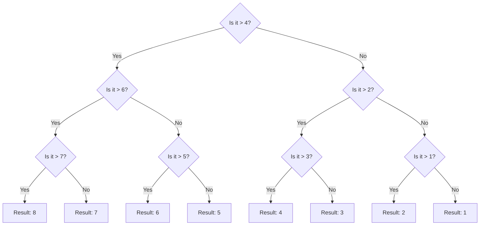
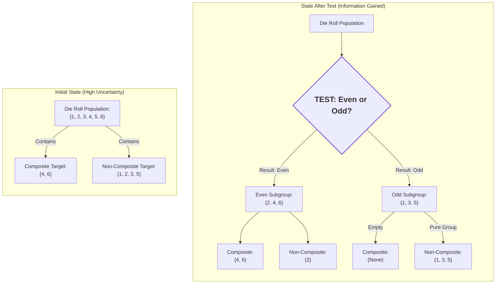

+++
title = "Surprise! A derivation of entropy"
date = "2025-12-04T22:07:36-08:00"
description = "I explain entropy to myself"
link = ""
tags = ["machine learning"]
categories = ["Machine Learning", "Computer Science"]
includes = [ ]
hasequations = true
tableofcontents = true
draft = false
slug = "surprise-derivation-entropy"
+++

In this post, I will derive entropy from first principles. This requires no more than a high school-level understanding of mathematics. This derivation is based on Shannon's original seminal paper, [*A mathematical theory of communication*](https://people.math.harvard.edu/~ctm/home/text/others/shannon/entropy/entropy.pdf).

## A derivation

### The conditions

We want a function, $H(n)$, which measures the uncertainty in a system in which we chose one of $n$ events that can occur. We would want it to exhibit the following three properties:

1. Continuity. If the probability of an event changes slightly, the measure of uncertainty in our choice should not suddenly jump.

2. Monotonicity. If the amount of possible events that can happen in the system increases, so does the measure of uncertainty in our choice. The uncertainty in a roll of a coin ($1/2$) is smaller than the uncertainty in a  roll of a die ($1/6$) which is smaller than the uncertainty of drawing a card from a deck ($1/52$).

3. Additivity. If choice from events can be broken up into a sequnce of multiple choices, then the uncertainties of the constituent choices should add up to the uncertainty of the system. The uncertainty of choosing a card from the deck is the same as the uncertainty of choosing the suit ($1/4$) and then the number on the card ($1/13$).

### Deriving entropy by reasoning about conditions

Let's say uncertainty measures choosing one of $n$ events that can happen, equally likely. We use the measure $H(n)$ to denote the uncertainty in the system. If the number of events that can happen changes, $n + \delta$, the measure $H(n+\delta)$ should change finitely too.

What if there are multiple choices to be made? For example, flipping multiple coins, or picking cards from multiple decks? There are $n$ possible events that can happen in the original system. A new System2 is composed of $k$ choices with, $n_1 = n_2, ..., n_k = n$ same number of outcomes from that pool of events. In this system2, an (aggregate) event is a collection of $k$ choices. Therefore, there are $N=n_1 \cdot n_2 \cdot ... n_k=n^k$ possible aggregate events. The measure of uncertainty in this system2 is $H(n^k)$.

Therfore, whether events are represented in aggregate as $n^k$, or sequentially as as $n_1, n_2,...,n_k$, the uncertainty should be the same. Therefore, by (3):

$$
H(n^k) = H(n_1) + H(n_2) + ... = k H(n)
$$



One function which satisfies this relationship is $\log$. This satisfies (1) i.e. continuity.

$$
k \log n = \log n^k
$$

Previously, each choice had the same outcomes. Now, generalizing to the case where successive choices do not have equal probabilities ($n_1 \neq n_2 ...$). For example, we can break down the guessing a card into two categories of events: (1) guessing the suit (one of $n_1 = 4$), and (2) guessing the number from that suit (one of $n_2 = 13$). After making our choices, there are still $N$ events than can happen (in this example, $n_1 \cdot n_2 = 4\times 13=52$), but we are first choosing a category, and then choosing from inside that category. Each category of choice has a different pool of outcomes.

So, if $N$ is the total number of events in this system:

$$
\begin{align*}
H(N) &= H(\text{categories}) + \sum_i p_i H(n_i) \\\\
-H(\text{categories}) &= \sum_i p_i H(n_i) - H(N) \\\\
&\text{The sum of probabilities is 1, so multiplying by it has no effect} \\\\
-H(\text{categories}) &= \sum_i p_i H(n_i) - \sum_i p_i H(N) \\\\
-H(\text{categories}) &= \sum_i p_i \left( H(n_i) - H(N) \right) \\\\
-H(\text{categories}) &= \sum_i p_i \left( \log n_i - \log N \right) \\\\
-H(\text{categories}) &= \sum_i p_i \left( \log (n_i / N) \right) \\\\
&\text{$n_i/N$ is just the probability of $i^{th}$ choice} \\\\
H(\text{categories}) &= -\sum_i p_i \log p_i
\end{align*}
$$

### Why categories?

The emphasis on breaking a system down into categegories, or sequences of choices, is for the sake of generality. Sometimes, the individual events that can occur are not interesting for the sake of analysis. There may be infinitely many events that can take place. Instead, a combination or range of events is of interest. For example, a game where two dice are thrown and the winner is the throw with the highest sum. There are $6\times6=36$ aggregate events that can occur in this system. If all we cared about was describing these events, then the entropy would be $-\sum^{36}_1 \frac{1}{36} \log \frac{1}{36}=\log 36$. *However*, we care about the sum. There are 11 distinct sums ranging from 2 (1+1) to 12 (6+6), with non-uniform probabilities. Each sum may contain multiple events. Therefore, the entropy of this system where we care about sums is: $-\sum_1^{11} p_i \log p_i$.

This categorization is called the *macrostate*. The actual events are called the *microstate*. Sometimes, the macrostate is the same as the microstate. In many cases, it is not, as we saw earlier. Another example is temperature. Temperature is the average kinetic energy of molecules. The average kinetic energy is made up of indivudual velocities. However, we do not care about these microstates, only the aggregate statistic.

Also note that the total number of events - microstates - $N$, gets subsumed into the probability distribution.

> Entropy does not depend on the number of events (microstates), but the categorization of events (macrostates).

$$
H(macrostates...) = -\sum_i p_i \log p_i
$$

The distribution of macrostates and relation to entropy is intuitively understood. There are two outcomes of a coin toss, equally likely. Let's say the state we care about is win or lose. In this case, the there is a 1:1 correspondence between the micro- and macro-states. The entropy of this system is:

$$
H([win, lose]) = - (0.5 \log 0.5 + 0.5 \log 0.5)
$$

In case of a six-sided die. Again, macro- and micro- states are the same:

$$
H([1,2,3,4,5,6]) = - 6 * (1/6 \cdot \log 1/6)
$$

In case we care about whether the die landed on composite vs non-composite numbers, the macro-states are different:

$$
H([\text{composite}, \text{non-composite}]) = H([4,6], [1,2,3,5]) = - (1/3 \cdot \log 1/3 + 2/3 \cdot \log 2/3)
$$

## A digression on logs

Why is the $\log$ function a good fit, intuitively? Take $\log_2 8=3$. On face value, it represents the power the base will be raised to to equal the argument.

On a deeper glance, it represents the minimum number of choices needed to describe an event. For example, guessing a number. A base of 2 means, at each step a choice is made, dividing the events into 2 sets. We can encode each choice with a bit (0, 1). In the following example, there are 8 events. At *least* $\log_2 (8) = 3$ choices, and therefore bits, are needed to represent all events.

This makes sense for integer arguments. What does it mean when we take a log of probabilities when calculating entropy? Well, a probability is a ratio of a category of events to the total number of events, $n_i/N$. The log of a probability is the difference between the logs of events. We take a negative log to measure entropy, as derived above: $-\log(n_i/N) = \log (N/n_i)= \log(N) - \log(n_i)$. This tells us: I need to make only $c_i = \log n_i$ choices to describe one amongst $n_i$ events, but $C = \log N >= c_i$ choices to describe one in $N$ events. The difference is the extra choices I have to make to describe $N$ events, compared to just $n_i$ events. Then, for all categories of events ($n_1, n_2, ..., n_k$), we take a weighed sum to say: It costs me $C - c_i$ extra choices $n_i/N$ of the time, and $C - c_k$ etra choices $n_k/N$ of the time and so on, for an everage of

$$
H(macrostates...) = - \sum_i^k p_i \log p_i
$$

extra choices for a certain probability distribution over $k$ categories of $N$ events.

Let's revisit the original equation decomposing choices:

$$
\underbrace{H(N)}_{\text{bits to represent all choices}} =
$$

$$
\underbrace{H(\text{categories})}_{\text{bits to represent categories}} +
$$

$$
\sum_i \underbrace{p_i \cdot H(n_i)}_{\text{chance of category} \times \text{bits to represent events in category}}
$$

Here, $H(\text{categories})$ over all $p_1, p_2, ..., p_k$ is the extra bits we need to be able to describe all possible events, if the events inside categories have assigned bits already. It is the measure of *surprise* of this distribution.

> Entropy is the minimum additional bits needed to describe categories of events.

Play around with the widgets below to get an understanding.

1. If the number of categories of events that can occur is small, then fewer choices are needed to describe all events. (Move the slider to observe. For 2 categories, we only need 1 bit. For 4, we need 2 bits and so on.)
2. If a category of event is more likely to occur, then other categories are less likely to occur. Therefore, we can organize choices so the most frequent event needs the fewest, and unlikely events need more. The average number of choices - entropy - goes down. In the extremely skewed case, only 1 category of event happens and the rest are impossible. We don't need to make any choices to describe the events - because there's one possibility. This is 0 entropy. (Draw a step distribution - which is low for one category and high for another.)



## How to think about entropy?

### Surprise

Entropy is the unexpectedness in the individual events and the categorization we care about.

If when rolling a die, all we care about was that a number less than 7 was rolled, the entropy is $-\sum 1 \log 1=0$. Each microstate is as fungible as the other. We don't care because any outcome fits the bill.

If, when rolling a die, we care about what the number was, then the entropy is $-\sum_1^6 \frac{1}{6}\log \frac{1}{6} = \log 6 > 0$. We care a lot about each individual microstate.

### Dimensionality

Entropy is the number of choices needed to describe categories of events. If each choice were a separate axis in a coordinate system, entropy is the dimensionality of the categorization.

We've been taking $\log_2$ for convenience. This means that each choice - axis - has 2 possible values. But, we can extend to any logarithm base to represent the number of values on an axis.

## How to use entropy?

There are several ways $H$ can be used to measure the degree of surprise in a system.

### Information gain

How valuable is a choice already answered when describing events? Is it better to know that a cast die is an even number, or that a drawn card is red/black?

To measure this, we can compare the surprise - unexpectedness - in the system before and after a choice is made.

$$
I = H(\text{categories}) - H(\text{categories}|\text{choice})
$$

Given the die example. Let's say we know the number chosen will be even.

$$
\begin{align*}
H([\text{composite}, \text{non-composite}]) &= H([4,6], [1,2,3,5]) = - (2/6 \cdot \log 2/6 + 4/6 \cdot \log 4/6)\\\\
H([\text{composite}, \text{non-composite}] | \text{even?}) &= 0.5 \cdot H([4,6], [2]) + 0.5 \cdot (H[], [1,3,5]) = \\\\ &- 0.5 \cdot (2/3 \cdot \log 2/3 + 1/3 \cdot\log  1/3) - 0.5 \cdot (3/3 \cdot\log  3/3)
\end{align*}
$$

The difference is ~$0.318$ bits of entropy saved when we know whether a number is even. So, it's good to know!

Decision trees use [information gain](https://en.wikipedia.org/wiki/Information_gain_(decision_tree)) to find splitting on which attribute and which value yields the highest information gain. The more bits we can save with each choice, the fewer total choices we need to make to describe/predict a category.

### Cross-entropy

Entropy is the minimum number of bits (choices) needed to describe events following a distribution. What if the choices are optimized for another distribution (let's call it the encoding distribution)? In that case, how efficiently will be the actual distribution be represented?

[Cross entropy asks:](https://en.wikipedia.org/wiki/Cross-entropy) how many bits on average will be needed to describe a distribution $p$, given a coding scheme optimized for another distribution, $q$?

$$
H(p, q) = - \sum_i^k p_i \log q_i
$$

For example, assume a biased coin flip. The distribution of outcomes, $q$ covers just 2 events, heads & tails with a 90-10 probability. Now consider that we actually have an unbiased coin, which shows heads and tails evenly:

$$
H(\text{unbiased coin sampling}, \text{biased coin distribution}) = - (0.5 \log 0.9 + 0.5 \log 0.1))
$$

The entropy of the unbiased coin is 1 bits (we need 1 bit to describe heads and tails which are equally likely). The entropy of the biased coin is 0.47 bits (we do not need any bits to describe a certain outcome. In this case it is almost certain at 90%, therefore on average we need fewer than 1 bits). The cross entropy is 1.73 bits.

Intuitively, since the encoding scheme is optimized to represent an all-but-certain outcome of events (90% heads), suddenly using it to represent a more diverse distribution is inefficient.

On the flip side, let's say we assume an unbiased coin flip. And then try to represent a biased coin using the unbiased scheme. Intuitively, an unbiased coin flip will have the highest entropy. The outcomes are evenly spread out, and therefore we will need to describe every event an equal number of times, using up all the bits available. Therefore, the cross entropy - the average number of bits needed to represent a biased die - will be 1 bits.

$$
H(\text{biased coin sampling}, \text{unbiased coin distribution}) = - (0.9 \log 0.5 + 0.1 \log 0.5))
$$

Play around with the widget to understand the interaction between actual and encoding distributions. The cross entropy is smallest when distributions are similar. This is used in machine learning as a loss function when optimizing a function that predicts a probability distribution. The desired, encoding, distribution peaks at the currect value. Whereas, the predicted distribution may be random in the beginning.


