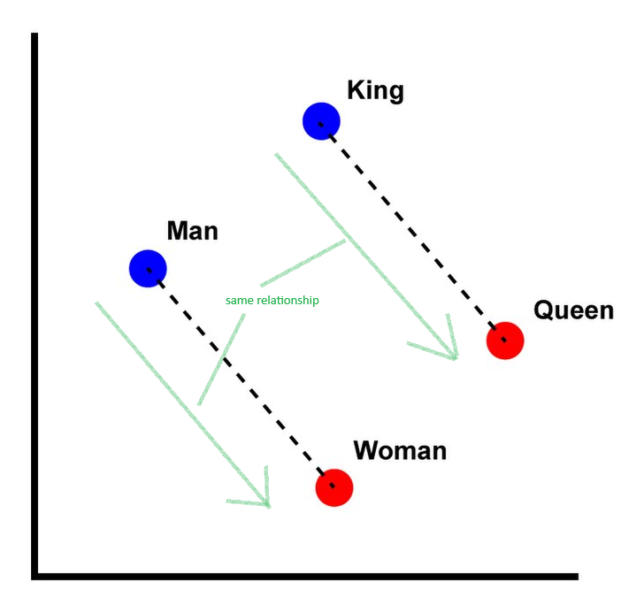

+++
title = 'Helping fix aircraft - from NLP to Bayes Nets'
date = '2023-10-25T10:55:00-05:00'
description = "NLP to help aircraft mechanics reason about maintenance actions"
tags = ["nlp", "machine learning"]
categories = ["developer"]
link = ""
hasequations = true
includes = []       # any javascript files to include
tableofcontents = true
draft = false
+++



Behind every strong, graceful aircraft is a mechanic. Likely a team of mechanics who work diligently to maintain the machine. Maintenance is not about fixing a problem after it occurs, but preventing one from occurring in the first place. That requires tracking the state of the vehicle and stepping in to fix things periodically.

A research project I am contracted on is to streamline maintenance procedures for helicopters. My background is in electrical engineering/machine learning research with some application to aerospace.

The objective is to help mechanics 

1. retrieve probable maintenance actions from their knowledgebase.
2. and to evaluate likely causes and outcomes of actions.

The knowledgebase consists of aircraft manuals and past inspection and maintenance logs. Aircraft crews maintain extensive logs. They log observed issues with the aircraft and the actions taken in response. Logs can be messy. Sometimes logs are incomplete or inconsistent. Sometimes teams develop their own shorthand terms. Sometimes there are too many logs. Sometimes there are too few.

## The data

The data were in the shape of natural language documents. Broadly, they were in two categories: problems and actions.

The first problem with the data was that I did not have the data. It was mildly concerning. The data were going through extensive security clearances before it landed on my desk. While I waited, I decided to to a literature review and look for similar datasets. That would help me orchestrate a data-processing pipeline which I could transfer over to the real, de-classified data.

I found an open source dataset obtained from real-world aircraft. It is called [MaintNet](https://people.rit.edu/fa3019/MaintNet/data_aviation.html). Here is what it looks like:


Maintnet consists of ~6000 instances of real-world aircraft problems and maintenance actions. Each record contains a sanitized, natural language description of the aircraft. Just from observation, the vernacular of maintenance logs is different from everyday conversation. This shows how important it is to have training data from the right domain.

## The approach

This was my approach:


I have heavily redacted parts of data extraction and pre-processing, but the essence of my solution remains. The pipeline converts text into vectors in continuous space, into discrete clusters, and finally into probability distributions.

### NLP

Natural Language Processing: reasoning about words by representing them as numbers, basically. For this project, the NLP tasks I am concerned about are "text embedding", "document retrieval", and "question answering".

With text embedding, words are represented as a vector. Where vectors in that vector space have correspondences that the words they derived from would have in the language domain. A classical example is the Word2Vec algorithm (modified, original image courtesy of Singrep on Wikipedia):



The image shows how the vector representations of words have intuitive relationships. The same vector that relates masculine to feminine versions of a word, relates masculine to feminine versions of other concepts.

The word2vec model works by training a single-layer neural network to predict (a) the next word given the last word, or (b) the missing word given surrounding context words. The output of the hidden layer then is the vector representation of the word.

Words input to the network as represented as one-hot vectors. A one-hot vector is a vector of zeros the size of the vocabulary. There is only one '1' in the vector, representing the word being represented. For example, if my vocabulary is the English alphabet, the one-hot vector for 'd' will be a vector of length 26, all zeros except for the 4th element. One-hot vectors for words can be large. There are many more words, than there are letters.

Word2Vec can be extended to embed sequences of words. That is, generate embeddings for documents. The extension is called Doc2Vec. Doc2Vec works in a similar fashion. In addition to feeding the context words to the neural network, it also feeds the location of the block of text. For example, paragraph number. The network can then use the vector representation of location to condition its word prediction. Thus, the hidden layer projecting text location to a vector gives the document embedding.

### Manifold learning

The output of the NLP step is a vector representation of documents. The vector representation may be large. For Maintenet dataset, I chose an embedding size of 50 to capture diversity of data. However, a 50-dimensional space populated by only 6000 data points is *very, very* sparse. To learn probability distribution over the document embeddings, they need to be projected down to a smaller space. I chose 3 dimensions for visualization and explainabiltiy.

Why could I not train a Doc2Vec model with an embedding size of 3 in the first place? I tried, but the inference of that model was not good. Recall that a Doc2Vec model is representing words and context by a vector, and using that vector to predict the next word. It is taking a one-hot vector from a large space, compressing it to a small embedding space, and then outputting another one-hot vector. So, a small embedding space will cause the model to lose information. So yes, while the representation is in a low dimension, it is also a less useful representation for prediction. Therefore, it is better to let the model adequately embed words and context a vector space large enough for its expression, and then project it into lower dimensions after model is finished training.

This is where manifold learning comes in. By reasoning about how individual data points are related, manifold learning preserves the relationships in a lower dimension. For example, let's say the only relationship we care about is that the nearest point is preserved for every other point. Then an algorithm can represent higher dimensional data along a one-dimensional number line, where adjacent points are those that were closest to each other in their original space.

### Clustering

Once documents are represented as points in continuous space, they can be labelled by similarity. For example, documents about propeller faults should be distributed near each other in the projection space we got from manifold learning.

I used [Hierarchical Density Based Scanning](https://scikit-learn.org/stable/modules/generated/sklearn.cluster.HDBSCAN.html#sklearn.cluster.HDBSCAN) to cluster documents in 3 dimensions. HDBSCAN does not need the number of clusters *a priori*, and so lets me explore the modes in the distribution more flexibly.

An important hyperparameter for clustering is the distance measure. I went with the default (Euclidean) which makes sense in 3D space.


Once clustered, the data look like this:


### Bayes Nets

With discrete labels representing documents, I now have a list of pair-wise relationships between problems and maintenance actions on aircraft. Instead of memorizing all pairs, I can learn the probability distribution of problems and actions. Knowing probabilities lets me reason about:

1. How likely are different problems to occur
2. How likely are maintenance actions
3. What alternative maintenance options are there, given the same problem? How likely are they?
4. What alternative causes are there for some maintenance action done?

Bayes Nets are built on top of [Bayes' theorem](https://www.mathsisfun.com/data/bayes-theorem.html):

$$P(A \mid B)\cdot P(B) = P(B \mid A) \cdot P(A)$$
That is, for an event $A$ and an event $B$, the probabilities of them occurring are related by the knowledge of the other event. When there is a *network* of events, this rule can be cascaded to get the conditional probability of an event given evidence about other events.

In this case, the network has only two nodes: problem and action. The conditional probability distribution looks like this:


The Bayes Net was built using [bnlearn](https://erdogant.github.io/bnlearn/pages/html/index.html).

## Inference

The entire pipeline is now set up. It has the following steps:

1. Embed text into continuous vector space
2. Project embeddings to a low dimensional space
3. Assign cluster labels, representing different document modes
4. Learn the probability and conditional probability distribution of problem and action modes

When using this during operation, only step 4 is changed. The Bayes net is already learned, and the new evidence of problems and/or actions can be used to infer likely outcomes.

One inference application is to give a text answer, given a text input. For example, a mechanic provides a new problem description, and the pipeline responds with the likelihoods of the most probable maintenance actions.

Given trained models for embedding, manifold learning, and clustering, the new text input can be converted to cluster labels. The cluster labels are the evidence fed to the Bayes net to infer likelihoods.

Once the Bayes net outputs the probability distribution over possible maintenance actions, the documents can be randomly sampled accordingly. This gives the user a concise overview of the scope of next steps.

The function `query` encapsulates pipeline inference. Given a query to the system about a new problem,

```python
query('gaseket is leaking')

# Use Doc2Vec to embed to vector
# Use manifold learning (Isomap) to project to 3D
# Use k-Nearest Neighbors to assign cluster label
# Use cluster label as evidence and get conditional probabilities of other clusters
# Sample documents from other clusters by conditional probability
```

The results are:

```
Cluster 0, 10 samples
================
TRIED TO ADJUST IDLE SEVERAL TIMES, WOULDN'T ADJUST.
TIGHTENED HOSE CLAMPS.
TIGHTENED SCREWS.
A/C WAS RUN UP, SET IDLE SPEED, MIXTURE OK, NO LEAKS NO
TIGHTENED HOSE CLAMPS.
REMOVED & REPLACED GASKET.
TIGHTENED HOSE CLAMPS.
TIGHTENED HOSE CLAMPS.
REMOVED & REPLACED GASKETS.
A/C WAS RUN UP, SET IDLE SPEED, MIXTURE OK, NO LEAKS NO
```

## Next steps

In the age of Large Language Models (LLMs) based on Transformer architecture, using single-layer neural networks seems quite primitive. It is. However, I favor starting with simple prototypes. Simple, as in being easy to explain and interpret.

In this case, I can explain why the pipeline is selecting some actions and not others. I know similarity measures used to cluster documents together. I know the distribution of documents in embedding space to understand why the Bayes Net may confuse two problems/actions together.

Fine-tuning a LLM on this corpus may result in a more conversational application, but it comes at the cost of explainability. Although, there is exciting work being done with [Retrieval Augmented Generation (RAG)](https://arxiv.org/abs/2005.11401), wherein the LLM, instead of learning the whole database stochastically, instead queries the database converted to vector embeddings. In that case, I can:

1. replace the Doc2Vec embedding step with the LLM's Transformer model,
2. use those vectors for manifold learning, clustering, and Bayesian learning as usual,
3. output documents containing likely actions by sampling over conditional distribution,
4. and using the LLM to then summarize the sampled subset of documents, instead of running similarity query over the whole database.


## Read more about...

[NLP (Wikipedia)](https://en.wikipedia.org/wiki/Natural_language_processing?oldformat=true)  
[LLM (Wikipedia)](https://en.wikipedia.org/wiki/Large_language_model?oldformat=true)  
Bayes Nets: [UC Davis Slides](https://www.cs.ucdavis.edu/~vemuri/classes/ecs170/bayesnet2.pdf), [University of Washington Slides](https://courses.cs.washington.edu/courses/cse473/19sp/slides/cse473sp19-BayesNets.pdf)  
Manifold Learning: [Excellent Analysis of different techniques](https://jakevdp.github.io/PythonDataScienceHandbook/05.10-manifold-learning.html), [Scikit-Learn reference](https://scikit-learn.org/stable/modules/manifold.html)
