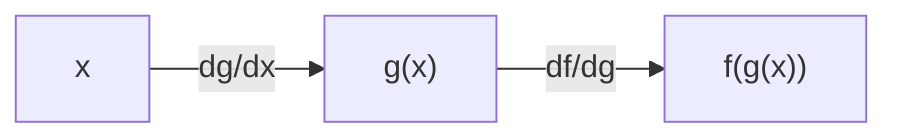
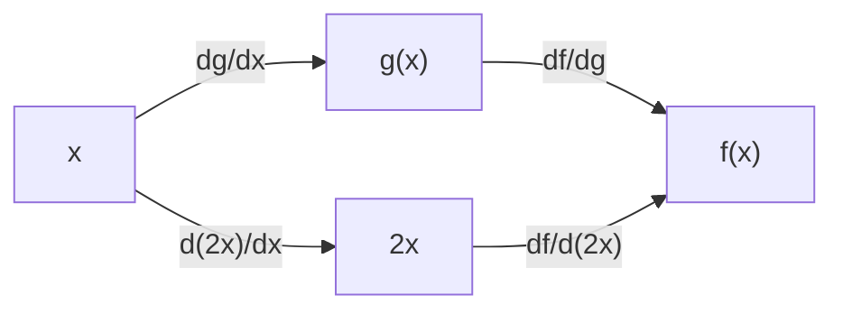
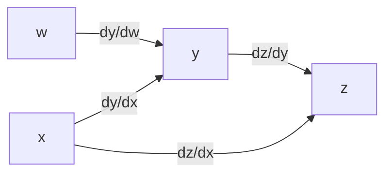
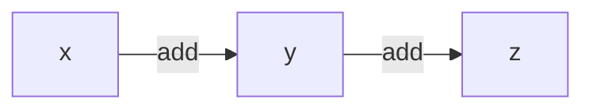

+++
title = "Poor Man's Autograd"
date = '2026-03-27T22:57:59-07:00'
description = "Deriving the code for differentiating code. Inspired by microgpt."
link = ""
tags = ["neural networks", "llm", "graphs"]
categories = ["Machine Learning"]
includes = []       # any javascript files to include
hasequations = true
haspython = true
tableofcontents = false
draft = false
[params]
   featured_image = "thumbnail.jpg"
+++



I recently came across [microgpt](https://gist.github.com/karpathy/8627fe009c40f57531cb18360106ce95) - a single-file, python-only training script for a GPT model.

What stood out to me were 40 or so lines that implemented autograd. That is, calculating gradients of computations in native python. Autograd is not novel ([python autograd](https://autograd.readthedocs.io/en/latest/background.html)). It underpins every single deep learning library ([jax](https://docs.jax.dev/en/latest/automatic-differentiation.html), [torch](https://docs.pytorch.org/tutorials/beginner/blitz/autograd_tutorial.html), [tensorflow](https://www.tensorflow.org/guide/autodiff), [and yes, numpy too](https://github.com/HIPS/autograd)).

No, the reason I was so taken aback was explicitly facing the simplicity of the mechanism that has fueled machine learning for decades now. It's one thing to call `loss.backward()`; it's an entirely different thing to pause and examine what's happening underneath.

The goal of this post is to build up those 40 lines, step by step. First, we revisit two rules of differentiation. Then we represent differentiable values in code. Finally, we apply the two rules over a few revisions, each more complex.

## The Chain Rule

The derivative multiplies over function composition.

$$
\frac{\partial}{\partial{x}} f(g(x)) = \frac{\partial}{\partial g}f \cdot \frac{\partial}{\partial x} g
$$

For example:

$$
f = g(x)^2\\\\
g(x) = kx \\\\
\frac{\partial}{\partial{x}}f = \frac{\partial}{\partial g}(g(x)^2)\cdot \frac{\partial}{\partial x} (kx)\\\\
= (2 \cdot g(x)) \cdot k \\\\
= 2 k^2 x
$$

Note:



## The distributive property

The derivative is distributive over addition.

For example:

$$
f = g(x) + 2x \\\\
g(x) = kx \\\\
\frac{\partial}{\partial{x}}f = \frac{\partial}{\partial x}(g(x)) + \frac{\partial}{\partial x}(2x) \\\\
= \left(\frac{\partial}{\partial g}(g(x))\cdot \frac{\partial}{\partial x} (kx) \right) + \frac{\partial}{\partial x}(2x) \\\\
= (1 \cdot k) + 2
$$

Note:



Looking at the graph, $x$ affects $f(x)$ twice: once through $g(x)$ and once through $2x$. Visually, the change in $f$ with respect to $x$ should add the change due to each of the two branches.

## The atomic value

We need to represent each scalar such that we can contain its value and gradient. Each operation produces a new value.

```python
class Value:
    def __init__(self, data, grad):
        self.data = data
        self.grad = grad
        
    def __add__(self, other):
        result = self.data + other.data
        result_node = Value(data=result, grad=1)
        return result_node
```

Let's try it out:

```python
w = Value(2, grad=0)
x = Value(1, grad=0)
y = w + x
z = y + x
print(z.data)
```



Now, we need a backward pass. What is `dz/d[w,x,y]`? Note that each intermediate result, starting from the inputs, is a `Value` object. Also note that the relationships lend themselves to a graph representation. We can call each `Value`, be it input, intermediate, or output, a *node* in the computation graph.

Note that the gradients from the two edges to `x` get added (the distributive property). One path has multiple hops `y--z` and `x--y`. Their gradients get multiplied (the chain rule), before being accumulated into `x`.

Since, there are multiple paths back from `z` to `x`. Therefore, `x` needs to keep track of all the gradients it has accumulated so far. This can be done in the `grad` attribute.

To traverse edges, we need to track the dependencies of each node. Then we can calculate, for each operation (i.e. edge), `d node / d dependency`. For addition, dependencies are the two arguments into the add operation. They can be tracked as a tuple attribute `deps`. The pesudocode for an add operation is:

```py
 y = w + x
 z = y + x

 # dz/dx = [dz/dy * dy/dx] + dz/dx 
 #         \--chain rule--/
 #         \--distributive property--/

 for dep in z.deps: # i.e. y, x
     # new gradient =
     dep.grad = \
        # current gradient (distributive property)
        dep.grad + # it's 0 for now \
        # parent's gradient (dz/dz) * gradient of add operation (chain rule)
        (z.grad * 1)

 # Then proceeding down the graph to the deps of deps
 for dep in y.deps: # i.e. w, x
     # new gradient =
     dep.grad = \
        # current gradient (distributive property)
        dep.grad + # non-zero for x; it was visited earlier ^^ \
        # parent's gradient (dz/dy) * gradient of add operation (chain rule)
        (y.grad * 1)
```

Putting it together:

```python
class Value:
    def __init__(self, data, grad=None, deps=()):
        self.data = data
        self.grad = grad
        self.deps = deps
    def __repr__(self): return f"V({self.data}, {self.grad})"
    def __add__(self, other):
        data = self.data + other.data
        deps = (self, other)
        return Value(data=data, grad=None, deps=deps)
    def backward(self):
        # The root node: d(root)/d root = 1
        if self.grad is None:
            self.grad = 1
        for dep in self.deps:
            # This is the first time the dependency is seen.
            # It does not have any gradients accumulated.
            if dep.grad is None:
                dep.grad = 0
            # accumulating edges = last total + gradient of current edge
            dep.grad = dep.grad + (self.grad * 1)
            dep.backward()
```

Let's try it out:

```python
w = Value(2)
x = Value(1)
y = w + x
z = y + x
# z = (w+x) + x = w + 2x
# dz/dx = 2, dz/dy = 1, dz/dw = 1
print("z", z)

z.backward()
print(f"dz/dz: {z.grad}")
print(f"dz/dy: {y.grad}")
print(f"dz/dx: {x.grad}")
print(f"dz/dw: {w.grad}")
```

## Adding operations

Looking closely at the gradient accumulation line, let's think from the perspective of `y`:

```py
 dep.grad = dep.grad + (self.grad * 1)
```

The `self.grad * 1` is the chain rule in action. Where `1` is the gradient of an addition operation. `y = x + w`, `dy/dx = 1`. We're multiplying that by whatever gradients are coming down from top. In this case, `dz/dy`. Therefore, the gradient coming to `x` (the `dep` in `self.deps`) from `z` through `y` (self) is `dz/dy * dy/dx` i.e. `self.grad * 1`.



If instead the operation from `x` to `y` were multiplication, the gradient would be different. Therefore, we need to track the operation that relates a node to its dependencies. Such that, the new gradient update line should become:

```py
 dep.grad = dep.grad + (self.grad * partial(self, dep, other))
```

Then:

```py
 partial_add = lambda self, dep, other_dep: 1
 partial_mul = lambda self, dep, other_dep: other_dep.data
 partial_pow = lambda self, dep, other_dep: other_dep.data * dep.data ** (other_dep.data-1)
 partial_exp = lambda self, dep, other_dep: self.data
```

This size-two tuple (`dep`, `other_dep`) works because all operations can be represented as a binary tree. For example `x * y * z` is `(x * y) * z`.

```python
class Value:
    def __init__(self, data, grad=None, deps=(), partials=()):
        self.data = data
        self.grad = grad
        self.deps = deps
        self.partials = partials
    def __repr__(self): return f"V({self.data}, {self.grad})"
    def __add__(self, other):
        data = self.data + other.data
        deps = (self, other)
        partials = (
            lambda self, dep, other_dep: 1,
            lambda self, dep, other_dep: 1
        )
        return Value(data=data, grad=None, deps=deps, partials=partials)
    def __mul__(self, other):
        data = self.data * other.data
        deps = (self, other)
        partials = (
            lambda self, dep, other_dep: other_dep.data,
            lambda self, dep, other_dep: other_dep.data
        )
        return Value(data=data, grad=None, deps=deps, partials=partials)
    def backward(self):
        # The root node: d(root)/d root = 1
        if self.grad is None:
            self.grad = 1
        if not self.deps:
            return # root node reached
        dep, *other = self.deps
        partial, *other_partial = self.partials
        
        if other:
            other = other[0]
            other_partial = other_partial[0]

        # This is the first time the dependency is seen.
        # It does not have any gradients accumulated.
        if dep.grad is None:
            dep.grad = 0
        # accumulating edges = last total + gradient of current edge
        dep.grad = dep.grad + (self.grad * partial(self, dep, other))
        dep.backward()

        if other:
            # This is the first time the dependency is seen.
            # It does not have any gradients accumulated.
            if other.grad is None:
                other.grad = 0
            # accumulating edges = last total + gradient of current edge
            other.grad = other.grad + (self.grad * other_partial(self, other, dep))
            other.backward()
```

Let's try it out:

```python
w = Value(2)
x = Value(1)
y = w * x
z = y + x
# z = (w*x) + x = wx + x
# dz/dx = w+1, dz/dy = 1, dz/dw = x
print("z", z.data)

z.backward()
print(f"dz/dz: {z.grad}")
print(f"dz/dy: {y.grad}")
print(f"dz/dx: {x.grad}")
print(f"dz/dw: {w.grad}")
```

We can clean this up a bit. Creating a class-level attribute to store partial derivative functions for supported operations. There are three kinds of operations:

1. Symmetric binary. The partial function is the same for both dependencies. For example `z = x+y`; `dz/dx = dz/dy = 1`. Same for multiplication; `z = x*y`; `dz/dx=y, dz/dy=x` i.e. `dz/d (one dependency) = other dependency`.
2. Unary operations. The operation only has one dependency. For example $e^x, \sin(x)$.
3. Unsymmetric binary. The partial function is different for each dependency. For example $z=x^y$.

```python
import math

class Value:
    _partials = {
        '+': lambda self, dep, other: 1,
        '*': lambda self, dep, other: other.data,
        '_^': lambda self, dep, other: other.data * dep.data ** (other.data - 1),
        '^_': lambda self, dep, other: self.data * math.log(other.data),
        'e': lambda self, dep, other: self.data,
    }
    def __init__(self, data, grad=None, deps=(), partials=()):
        self.data = data
        self.grad = grad
        self.deps = deps
        self.partials = partials
    def __repr__(self): return f"V({self.data}, {self.grad})"
    def __add__(self, other):
        data = self.data + other.data
        deps = (self, other)
        partials = (self._partials['+'], self._partials['+'])
        return Value(data=data, grad=None, deps=deps, partials=partials)
    def __mul__(self, other):
        data = self.data * other.data
        deps = (self, other)
        partials = (self._partials['*'], self._partials['*'])
        return Value(data=data, grad=None, deps=deps, partials=partials)
    def __pow__(self, other):
        data = self.data**other.data
        deps = (self, other)
        partials = (self._partials['_^'], self._partials['^_'])
        return Value(data=data, grad=None, deps=deps, partials=partials)
    def backward(self):
        # The root node: d(root)/d root = 1
        if self.grad is None:
            self.grad = 1
        if not self.deps:
            return # root node reached
        dep, *other = self.deps
        partial, *other_partial = self.partials
        
        if other:
            other = other[0]
            other_partial = other_partial[0]

        # This is the first time the dependency is seen.
        # It does not have any gradients accumulated.
        if dep.grad is None:
            dep.grad = 0
        # accumulating edges = last total + gradient of current edge
        dep.grad = dep.grad + (self.grad * partial(self, dep, other))
        dep.backward()

        if other_partial is not None:
            # This is the first time the dependency is seen.
            # It does not have any gradients accumulated.
            if other.grad is None:
                other.grad = 0
            # accumulating edges = last total + gradient of current edge
            other.grad = other.grad + (self.grad * other_partial(self, other, dep))
            other.backward()
```

```python
w = Value(2)
x = Value(2)
y = w * x
z = y + x**Value(2)
# z = (w*x) + x**2 = wx + x
# dz/dx = w+2x, dz/dy = 1, dz/dw = x
print("z", z.data)

z.backward()
print(f"dz/dz: {z.grad}")
print(f"dz/dy: {y.grad}")
print(f"dz/dx: {x.grad}")
print(f"dz/dw: {w.grad}")
```

Homework: how to take higher order derivatives? Grads of grads? Hint: the `grad` attribute is calculated by the same operations as the original computation graph: add/multiply/exp. Then, it can be wrapped in a `Value` too, right? If so, we can call `backward()` on it as well.