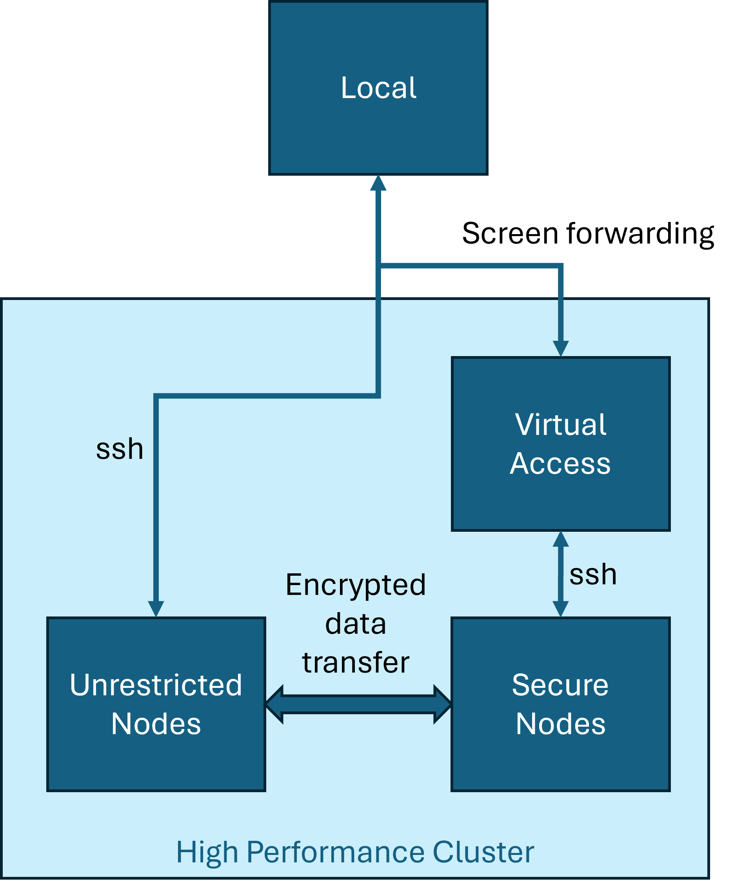

+++
title = 'Running python on air-gapped systems'
date = '2024-01-13T12:32:13-06:00'
description = ""
tags = ["python"]
categories = ["Developer"]
link = ""
hasequations = false
includes = []       # any javascript files to include
tableofcontents = false
draft = false
+++

In this post, I talk about running python code on a "soft" air-gapped system.

For research with the Department of Defense (DoD) and the University of Tennessee, Knoxville  (UTK), I worked with restricted data. The DoD was very strict about who had access to the data. After much negotiation and bureaucratic back-and-forth, the data were placed deep inside UTK's high performance compute cluster's (HPC) secure nodes (SN). 

The SNs were "softly" air-gapped. There was no internet access. I could use ssh to access the linux resources. *However*, the ssh session was simply a screen forwarding of the console session on the intermediate device which was actually ssh-ing to the SN. That is, I could not transfer files back and forth. The latest version of python available on SN was the Anaconda 3.5 installation.

The research involved machine learning with Natural Language Processing and prognostics. Now, if it were linear regression and support vector machines, I'd have been happy with python 3.5. There's so much that has changed in language processing that having an out of support python installation is a non-starter.



The standard solution was the following. My colleague, John Duggan, at UTK was extremely helpful here. He spent hours talking with the IT folks to get a working solution:
1. Log into unrestricted nodes.
2. Create a conda environment.
3. Zip the conda environment.
4. Encrypt and transfer to SN.
5. Unzip and have fun.

```bash
conda create -p $ENV_DIR python=$PYTHON_VERSION
conda activate ./$ENV_DIR
python -m pip install -r requirements.txt
tar -cvzf $ENV_DIR.tgz ./$ENV_DIR
```

This worked for simple python packages. Anything involving scientific python dependencies would fail with scary error output.

I surmised that the problem was with compiling extensions. Some errors were due to a shared object file not being found. So, instead of compiling the environment before transfer, I downloaded packages and their dependency trees, and transferred the source to the SN.

```bash
python -m pip download -r ~/requirements.txt -d ./$DEPS
tar -cvzf $DEPS.tgz ./$DEPS
```

This time, I transferred the python installation `$ENV_DIR` and the dependency source code `$DEPS` to the SN.  After extracting the files, I' install them like so:

```bash
python -m pip install -r requirements.txt --find-links=./$DEPS --no-index

```

Still, scary error messages. Installation worked fine, but finding some shared object files was failing.

At this point, my options were: commit an act of espionage and transfer the data to my local machine, or keep digging to find those shared object files. After much internal turmoil, I chose the latter option.

The error messages when importing scientific libraries were long and scary. I employed an advanced developer technique hitherto before unused.

I scrolled up in my error logs.

```
Could not create symlink to /blah/blah/blah: Permission denied
...
...
```

Aha! The archiving operation was failing. I needed a way to dereference symbolic links, and copy the targets they were pointing to into the archive. First I tried making conda copy files when creating an environment:

```bash
conda create -p $ENV_DIR python=$PYTHON_VERSION --copy

```

However, this failed too. Then, I moved to the `tar` command. And what do you know? It has a `--dereference` option!

```
tar -cvzf --dereference $ENV_DIR.tgz ./$ENV_DIR
tar -cvzf --dereference $DEPS.tgz ./$DEPS
# (you can also use the -h flag instead of --dereference)
```

Finally, it worked! My pipeline now is:

1. Create empty conda environment
2. Download python dependencies
3. Archive python installation and dependency sources by dereferencing symlinks
4. Encrypt, transfer, extract
5. Install dependencies
6. Run code

```bash
# Create fresh python installation
conda create -p $ENV_DIR python=$PYTHON_VERSION
conda activate ./$ENV_DIR
python -m pip install -r requirements.txt
tar -cvzf --dereference $ENV_DIR.tgz ./$ENV_DIR

# Download dependencies
python -m pip download -r ~/requirements.txt -d ./$DEPS
tar -cvzf --dereference $DEPS.tgz ./$DEPS

# Encrypt, copy, extract $ENV_DIR and $DEPS
# ...

# Install on air-gapped system
conda activate ./$ENV_DIR
python -m pip install -r requirements.txt --find-links=./$DEPS --no-index
```