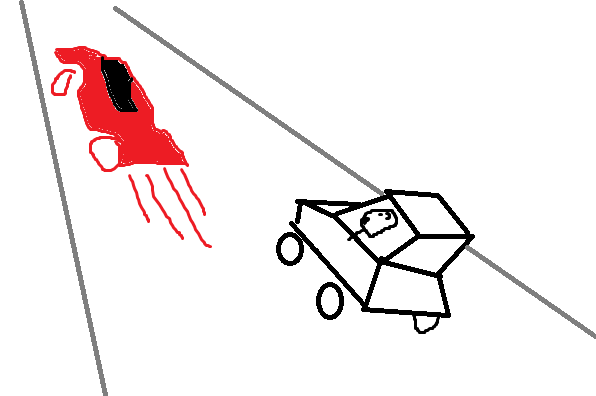

+++
title = 'GenAI and my six degrees of separation from tensor products'
date = '2024-06-28T09:30:04-05:00'
description = "My experiences getting up and running with GenAI and views on code interpretability."
tags = ["LLM"]
categories = ["Personal"]
link = ""
hasequations = false
includes = []       # any javascript files to include
tableofcontents = false
draft = false
+++

Lately I have been working with generative AI applications for work and personal projects. I learned a lot. But, I found learning and application stressful. I had envisioned going on a leisurly drive to sightsee and sample what GenAI has to offer. I quickly found myself in a golf cart on the Machine Learning freeway.

<figure>
    
    <figcaption>Made with GenHI (Human Intelligence)</figcaption>
</figure>

We are living in a gold rush of foundation models. Every week, new research quickly permeates into user space. Iterations of large language models (LLMs) beat last week's benchmarks. The "state-of-the-art" label has a new, shorter, shelf life.

And so, dear reader, when I started to hack projects in this space, I quickly discovered that attention was not, in fact, all I needed. There was to much to learn! So much new research to keep abreast with!

## The stress

I attribute part of my stress to impostor syndrome. So many accomplished engineers and scientists are making monumental contributions to artificial intelligence as a socially uniquitous tool. With a background in machine learing, I can grasp the work and discipline going into all those flashy AI product announcements. What's that saying? Comparison is the thief of joy.

I attribute another part of my stress to recency bias. Foundation models have, deservedly, occupied the public spotlight for the last few years. When I perused online forums discussing science and technology research, I found my bandwidth saturated with LLM-related work. My background is in reinforcement learning / ML for control applications. During grad school, that was my bubble. The immediacy of this huge body of novel research made me feel - small. Perspective is good for long term health. In the short term, I was getting the vapors.

The biggest stressor was using the software ecosystem spun up around LLMs for making applications. `langchain`, `llamaindex`, `ollama`, `litellm` and so many others. After trying out local llms using `transformers` & `huggingface`, I started exploring `langchain` and `llamaindex` for quick prototypes. I think they are great for doing 20% work to get 80% of the way there. But, man oh man, the remaining 20% was unsatisfactory, to say the least.

Why? Such high-level tools, by virtue of being so popular, try to capture the most usecases possible. The contributions made to the codebase, and therefore its design, cater to the lowest common denominator in the userbase. These libraries are targetting weekend hacking and production level multi-user, multi-server deployments. I think that necessitates extreme abstraction of logic. If you're looking for a quick Retrieval Augmented Generation application over a directory of plain text documents, great! If you're looking for a function-calling Agent which uses linear logic, great! But if you want to hop of the beaten path, and implement a custom retriever for example, you have to skip through all these layers of abstraction to find the right parts to tweak.

## The mismatch

This is not a critique calling for action on these libraries. Merely an explanation of fact. I found that such abstractions did not help me reason about what I was making. I had started this journey learning about attention mechanisms and quantization and low-rank adaptors and direct policy optimization. Quickly I had jumped to web applications where the all the backend did was to call `llm.chat('Use wikipdia to explain how reinforcement learning through human feedback works')`.

In my work in RL and controls, I could drop down from high level actions driving a complex system to the level of neural network layers doing tensor products for the policy function. Or the dynamics equations of the simulation. That helped me feel like I had a grasp on the end-to-end logic of my work. I did not find that here.

This could easily be hindsight bias. I had learned the ins and outs of code I was using. So it was easy to drop down layers of abstraction.

Also, natural language processing, perhaps inherently, is a more sophisticated optimization problem than physical systems. In NLP, uncertainty in outputs is more than noise introducing confidence bounds in outputs. The same input language could have the absolute opposite meaning because the tone was sarcastic. Therefore, there are many more layers of processing and abstraction to dive through.

## The dillema

So here was my dillema: I couldn't see my beloved tensor products all the way from popular LLM applications.

Perhaps I didn't need to. But, I'd have liked to.

So, now, I am trying to find a middle ground. Simple, nimble libraries like `llmx`, `litellm` which are llm-model-agnostic, but appear to operate on the level of string in, string out. This is a far cry from wrapping prompts into their own class instance and passing them through clunky pipelines with byzantine logic (llamaindex), or library-specific usage patterns achieved opaquely through operator overloading (langchain). They can also hook up with local model deployments for when I need to follow inputs every step of the the way to outputs.

I think these big production-grade libraries are commendable efforts. I have and will use them when needed. But the person in me who still wants to derive everything from first-principles, the versatility that comes at the cost of interpretability is too much of a compromise.
