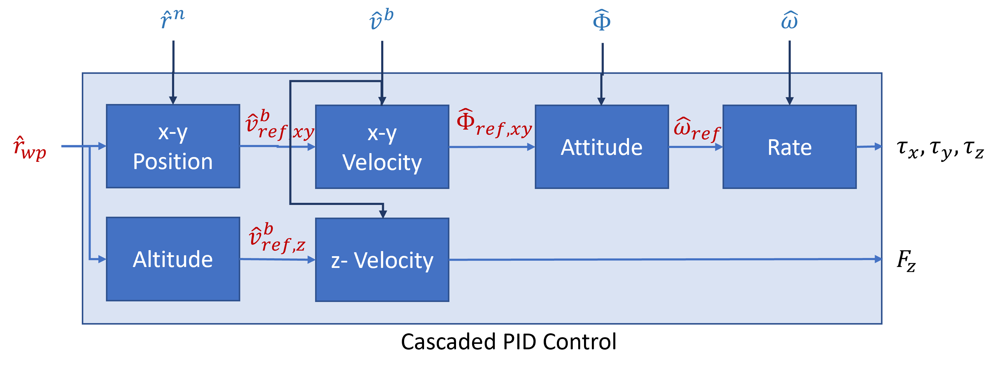

+++
title = "Drone physics"
date = "2024-01-27T19:22:34-06:00"
description = "Equations governing dynamics and control of a multirotor UAV"
tags = [ "simulation", "uav" ]
categories = [ "Engineering" ]
link = ""
hasequations = true
haspython = false
includes = ["https://cdn.jsdelivr.net/gh/nicolaspanel/numjs@0.15.1/dist/numjs.min.js"]
tableofcontents = true
draft = false
slug = "drone-physics"
image = "static/icon.png"
+++



This article describes drone physics. Audience should have familiarity with introductory linear algebra, introductory calculus, and introductory classical mechanics. This work was adapted from [my research in adaptive control](/about/) and publication at [AIAA DASC 2023](https://ieeexplore.ieee.org/abstract/document/9925862) about [`multirotor`](https://multirotor.readthedocs.io), a python simulation framework for drones. The notation here borrows heavily from the excellent work by [Charles Tytler](https://github.com/charlestytler/QuadcopterSim).

Join the discussion on [X](https://x.com/hazrmard/status/2067012993003438469), [Reddit](https://www.reddit.com/r/ControlTheory/comments/1u8e4q1/drone_physics_i_wrote_equations_of_motion_and/), [HackerNews](https://news.ycombinator.com/item?id=48562521)

> For more interactive explainers, see [Poor Man's Autograd]() and [Surprise! A Derivation of Entropy]().

The following topics are covered, in order:

1. The coordinate systems used to describe the vehicle.
2. The state variables used to describe the vehicle.
3. The forces and torques acting on the body.
4. Equations of motion (linear and angular).
5. How motors and propellers generate forces and torques.
6. How control systems determine propeller speeds.

## Describing the vehicle

A multi-rotor UAV is modeled with six degrees of freedom: the three linear axes for linear motion: $x, y, z$, and the three angular axes for rotational motion: $\phi, \theta, \psi$. To use coordinates, a coordinate system needs to be agreed upon. Typically the the [North-East-Down (NED) system](https://en.wikipedia.org/wiki/Aircraft_principal_axes) is used. The direction of the positive $x$ axis is considered "forward"/North orientation. The positive $y$ axis is "right"/East and the positive $z$ axis is "down".This is a right-handed coordinate system; positive rotation about an axis in the direction of the thumb is in the direction of the curled fingers. For example, a positive z-rotation goes from +x to +y.



Two reference frames are used for representing the state of the body:

1. Nominal, inertial, reference frame $n$ is the static frame of reference where the axes are aligned with arbitrary, global directions. They are represented as column vectors $\hat{n} = [\hat{x}^n, \hat{y}^n, \hat{z}^n]^T$.
2. Body-fixed, non-inertial, reference frame $b$ has the axes aligned with respect to the center of gravity of the rigid body in motion. They are represented as column vectors $\hat{b} = [\hat{x}^b, \hat{y}^b, \hat{z}^b]^T$. The body frame moves and rotates with the vehicle. Consider the origin of the body frame attached to the center of mass of the drone.

### Linear representation

The body-fixed reference frame $b$ is affixed to the center of mass of the vehicle. That is, the displacement of the vehicle from the body frame is always 0. The position of the vehicle is represented by the displacement of the body frame from the inertial frame, $\hat{r}^n$.

The velocity of the vehicle is the velocity of the body frame relative to the inertial frame. Here, we choose to represent velocity in coordinates of the body frame.

### Angular representation

Orientation of a body in the inertial reference frame follows the Tait-Bryan angles convention. That is, orientation can be described by three sequential rotations: yaw ($\psi$), pitch ($\theta$), and roll ($\phi$) - *in that order*. The order of rotations matters. Starting from the inertial frame $\hat{n}$, yaw $\psi$ is rotation $R(\psi)$ of the body frame about the inertial $z$ axis. Starting from this yaw-ed frame $\hat{n}\_\psi$, pitch $\theta$ is rotation $R(\theta)$ about the new $y$ axis. And starting from this yaw-ed and pitch-ed frame $\hat{n}\_{\psi,\theta}$, roll $\phi$ is the final rotation $R(\phi)$ about the new $x$ axis. The final product, $\hat{n}\_{\psi,\theta,\phi}$ is the body reference frame.



The angular velocity of the vehicle, $\hat{w}^T=[\omega_x,\omega_y,\omega_z]$, is the instantaneous rotational rate of the body frame about itself. Whereas each angle of orientation is defined in its own reference frame ($\hat{n}, \hat{n}\_{\psi}, \hat{n}\_{\psi,\theta}=\hat{b}$) during a sequence of ordered rotations from the inertial axes to the body frame (yaw, then pitch, then roll).

Roll rotation happens last and the result is the body frame. Therefore, $\omega_x$, the rate about the x-axis equals the roll rate, $\dot{\phi}$. Pitch happens after the initial yaw, but before roll. Therefore, $\omega_y$, the rate about the y-axis, is the pitch rate in the frame $\hat{n}_{\psi}$ rotated by roll $\phi$ to get the the body frame. Finally, yaw rotation happens first in the inertial frame. Therefore, $\omega_z$, the rate about the body frame's z-axis, is the yaw rate in the inertial frame rotated by pitch $\theta$ and roll $\phi$. This can be expressed as a matrix equation:

$$
    \begin{bmatrix}
    \omega_x \\\\
    \omega_y \\\\
    \omega_z
    \end{bmatrix} = R(\phi)\cdot R(\theta) \begin{bmatrix}
        0 \\\\ 0 \\\\ \dot{\psi}
    \end{bmatrix} + 
    R(\phi) \begin{bmatrix}
    0 \\\\ \dot{\theta} \\\\ 0
    \end{bmatrix} + 
    \begin{bmatrix}
    \dot{\phi} \\\\ 0 \\\\ 0
    \end{bmatrix}
$$

$$
    \begin{bmatrix}
    \omega_x \\\\ 
    \omega_y \\\\ 
    \omega_z
    \end{bmatrix} = \begin{bmatrix}
    \dot{\phi} + \dot{\psi} \sin{\theta}\\\\
    - \dot{\psi} \sin{\phi} \cos{\theta} + \dot{\theta}\\\\
    \dot{\psi} \cos{\phi} \cos{\theta}
    \end{bmatrix}
$$

### Reconciling inertial and body frames

A body frame may be different from the intertial frame due to (1) displacement and (2) rotation. The body frame's origin is fixed to the origin of the UAV. Therefore, the displacement of the body frame from the inertial frame is the inertial position of the UAV: $\hat{r}^n=[x,y,z]^T$.

A vector relative to the origin of the body frame will appear rotated if displaced to the origin of the inertial frame. Given a vector in the inertial frame $\hat{\mathcal{V}}^n=[x^n,y^n,z^n]^T$ and the same vector at the origin of the body frame $\hat{\mathcal{V}}^b=[x^b,y^b,z^b]^T$, the rotation matrix from the body to inertial reference frames $R_b^n$ is defined as, where each rotation matrix is:

$$
\begin{align}
 R(\phi) = \begin{bmatrix} 1 & 0 & 0 \\\\ 0 & c\phi & -s\phi \\\\ 0 & s\phi & c\phi \end{bmatrix}
 \end{align}
$$

$$
\begin{align}
 R(\theta) = \begin{bmatrix} c\theta & 0 & s\theta \\\\ 0 & 1 & 0 \\\\ -s\theta & 0 & c\theta \end{bmatrix}
 \end{align}
$$

$$
\begin{align}
 R(\psi) = \begin{bmatrix} c\psi & -s\psi & 0 \\\\ s\psi & c\psi & 0 \\\\ 0 & 0 & 1 \end{bmatrix}
 \end{align}
$$

$$
\begin{align}
    \hat{\mathcal{V}}^b &= R(\phi)\cdot R(\theta) \cdot R(\psi) \cdot \hat{\mathcal{V}}^n \\\\
    \hat{\mathcal{V}}^b &= R_n^b \hat{\mathcal{V}}^n \\\\
    \begin{bmatrix}
    x^b \\\\
    y^b \\\\
    z^b
    \end{bmatrix} &=
    \begin{bmatrix}
        c\psi c\theta & - s\psi c\theta & s\theta\\\\
        s\phi s\theta c\psi + s\psi c\phi & - s\phi s\psi s\theta + c\phi c\psi & - s\phi c\theta\\\\
        s\phi s\psi - s\theta c\phi c\psi & s\phi c\psi + s\psi s\theta c\phi & c\phi c\theta
    \end{bmatrix}
    \begin{bmatrix}
    x^n \\\\
    y^n \\\\
    z^n
    \end{bmatrix}
\end{align}
$$

Here $c | s$ of $\phi | \theta | \psi$ refer to the cosine and sine respectively. This rotation is useful when looking at forces acting in the body frame from an inertial viewpoint. The above transforms a vector instantaneously between rotated reference frames.

### Reconciling derivatives in rotating frames

If, however, the vector is changing while the reference frame is rotating, then the rate of change is not as simple. The rate of change of a vector is due to (1) the change of the vector quantity itself in the body frame, and (2) the change of the frame coordinates.



That is, in a body frame rotating with instantaneous angular velocity $\hat{\omega}=[\omega_x,\omega_y,\omega_z]$ about its axes, the time-derivative of a vector in the body frame $\hat{\mathcal{V}}^b = \hat{b} \cdot \hat{\mathcal{V}}$ as measured *in a co-located inertial frame* is given by the [Transport theorem](https://en.wikipedia.org/wiki/Transport_theorem?oldformat=true):

$$
\begin{align}
    \frac{d \hat{\mathcal{V}}^b}{d t} &= \hat{b} \cdot \frac{d \hat{\mathcal{V}}}{d t} + \frac{d \hat{b}}{d t} \cdot \hat{\mathcal{V}} \\\\
    &= \hat{b} \cdot \frac{d \hat{\mathcal{V}}}{d t} + \hat{\omega} \times \hat{\mathcal{V}}^b \\\\
    &= \hat{b} \cdot \frac{d \hat{\mathcal{V}}}{d t} +
    \begin{bmatrix}
    0 & -\omega_z & \omega_y \\\\
    \omega_z & 0 & -\omega_x \\\\
    -\omega_y & \omega_x & 0
    \end{bmatrix} \hat{\mathcal{V}}
\end{align}
$$

Transport theorem and the cross product

Assume the body frame has instantaneous angular velocity $\hat{\omega}$ about each axis. Each basis vector will see a rotation over a time interval $dt$. For small values of $dt$, the angular displacement is small, $\hat{\omega} dt$, and the arc drawn by the tip of the unit vector can be approximated as a straight line of magnitude $1 \cdot \hat{\omega} dt$ (arc length equals radius times angle in radians):



$$
\hat{x}^b \rightarrow \hat{x}^b + 0\hat{x}^b + \omega_z dt \hat{y}^b - \omega_y dt \hat{z}^b \\\\
\hat{y}^b \rightarrow \hat{y}^b - \omega_z dt \hat{x}^b + 0 \hat{y}^b + \omega_x dt \hat{z}^b \\\\
\hat{z}^b \rightarrow \hat{z}^b + \omega_y dt \hat{x}^b - \omega_x dt \hat{y}^b + 0 \hat{z}^b
$$

In matrix form, each column vector represents the change to the basis vector:
$$
    \hat{b}\_{t+dt} = \hat{b}\_{t} +
    \begin{bmatrix}
    0 & -\omega_z & \omega_y \\\\
    \omega_z & 0 & -\omega_x \\\\
    -\omega_y & \omega_x & 0
    \end{bmatrix} dt
$$

The rate of change of the basis vectors of the reference frame is:

$$
    \frac{d \hat{b}}{dt} = \begin{bmatrix}
    0 & -\omega_z & \omega_y \\\\
    \omega_z & 0 & -\omega_x \\\\
    -\omega_y & \omega_x & 0
    \end{bmatrix}
$$

The matrix multiplication is equivalent to a cross product with the vector $[\omega_x, \omega_y, \omega_z]^T$.

The additive term is a fictitious force that accounts for non-inertial frame. Once that is accounted for, the dynamics can be solved for like an inertial frame. This can be used to integrate accelerations in the body frame to find body-frame velocity.

### The state of the vehicle

The vehicle dynamics are completely represented by 12 state variables: linear and angular displacement in each dimension, and their time derivatives:

1. $\hat{r}^n=[x,y,z]^T$ are the navigation coordinates in the inertial frame. This is the linear displacement of the body frame from the inertial frame.
2. $\hat{v^b}=[v^b_x, v^b_y, v^b_z]^T$ is the velocity of the vehicle along the body frame axes.
3. $\hat{\Phi}=[\phi, \theta, \psi]^T $ is the orientation of the body reference frame $b$ in Euler angles (roll, pitch, yaw) with reference to the inertial reference frame.
4. $\hat{\omega}=[\omega_x, \omega_y, \omega_z]^T$ is the instantaneous angular velocity along each of the body frame axes.

## Dynamics of multi-rotor UAVs

The previous section enumerated the variables that describe the vehicle. This section describes how variables change over time. Since state is split into linear and angular variables, the dynamics equations will be split into linear and rotational equations. Here, we choose to represent forces and moments in the body frame coordinates:

1. $\hat{F}^b=[F_x^b,F_y^b,F_z^b]^T$ are the net forces along the three body frame axes, where $\hat{F}^b=R_n^b \hat{F}^n$.
2. $\hat{\tau}^b=[\tau_x^b,\tau_y^b,\tau_z^b]^T$ are the moments along the three body axes, where $\hat{\tau}^b=R_n^b \hat{\tau}^n$.

The forces acting on the vehicle are thrusts and gravity. Moments are generated when the forces are applied at a distance from the center of gravity. (We can incorporate drag, but we assume it's insubstantial for now.) The force of gravity is $\hat{F_g}^n=[0,0,mg]$ in the inertial reference frame. In the body frame it becomes $\hat{F_g}^b=R^b_n \hat{F_g}^n$. The net force of the $p$ propellers in the body frame (thrust) is $\hat{T}=[0,0,\sum_i^p T_i]^T$, where $T_i$ is the thrust of the $i$th propeller. Thus, the total force acting on the center of mass is $\hat{F}^b=\hat{T} + \hat{F_g}^b$.

The multirotor is modeled as a rigid body. A rigid body has a constant mass distribution relative to its center of gravity.

### Linear equations of motion

Fundamental to the dynamics is Newton's second law of motion: force is the rate of change of momentum. Here it is written in terms of body-frame variables.

$$
    \hat{F}^b = \frac{d}{dt}(m\hat{v}^b)
$$

The above relationship can be re-written as using the abstraction provided by the Transport Theorem. This will give the force acting on the body according to the inertial frame. The mass is treated as a constant in both frames. That leaves:

$$
\begin{align}
     \hat{F}^b &= m(\hat{\dot{v}}^b + \hat{\omega} \times \hat{v}^b)
\end{align}
$$

The linear state variables ($\hat{r}^n$, $\hat{v}^b$) are determined primarily by the forces acting on the vehicle.  Thus solving for acceleration $\hat{\dot{v}}^b$ and equating with the acceleration acting on the body frame $\hat{F}^b / m$ yields the rate of change of velocity $\hat{v}^b$ in the body frame.

$$
\begin{align}
\hat{T} + R_n^b \hat{F_g}^n &= m(\hat{\dot{v}}^b + \hat{\omega} \times \hat{v}^b)\\\\
\hat{\dot{v}}^b &= \frac{\hat{T} + R_n^b \hat{F_g}^n}{m} - \hat{\omega} \times \hat{v}^b\\\\
\begin{bmatrix}
\dot{v}_x \\\\
\dot{v}_y \\\\
\dot{v}_z
\end{bmatrix} &=
\begin{bmatrix}
    - \omega\_{y} v\_{z} + \omega\_{z} v\_{y} + g \sin{\theta}\\\\
    \omega\_{x} v\_{z} - \omega\_{z} v\_{x} - g \sin{\phi} \cos{\theta}\\\\
    -\frac{T}{m} - \omega\_{x} v\_{y} + \omega\_{y} v\_{x} + g\cos{\phi} \cos{\theta}
\end{bmatrix}
\end{align}
$$

Using $R_b^n$ and the current body frame velocity $\hat{v}^b$ gives the rate of change of position $r^n$ in the inertial frame.

$$
\begin{bmatrix}
\dot{r}^n_x \\\\
\dot{r}^n_y \\\\
\dot{r}^n_z
\end{bmatrix} = R_b^n \begin{bmatrix}
    v_x \\\\
    v_y \\\\
    v_z
\end{bmatrix}
$$

### Angular equations of motion

Newton's second law can be applied in angular mechanics too. Moment is the rate of change of angular momentum.

$$
\hat{\tau} = \frac{d}{dt}(I\hat{\omega})
$$

Where $I$ is the moment of inertia matrix, also known as angular mass.

Going from linear to angular motion

Assume the force is acting on a point mass $m$ at some distance, $\hat{r}$, from the origin to cause a rotation about an axis of rotation. Only the component of force perpendicular to the position vector will cause rotation. This can be obtained by the cross product. Note that the component paralell to the position vector will cause linear acceleration.



The infinitesimal displacement $d\hat{r}$ can be approximated by an infinitisemal arc length of a circle originating at the origin. Then, $d\hat{r}=\hat{\omega} \times \hat{r}$.

Given the right-handed coordinate system, the direction vector of angular rotation points along the positive axis of rotation for counter-clockwise rotation. This can be used to simplfy the calculations that follow.

Applying the cross product to both sides, and substituting the arc length approximation:

$$
\begin{align}
    \hat{r} \times F &= \hat{r} \times  (m \cdot \frac{d^2}{dt^2}\hat{r}) \\\\
    \hat{r} \times F &= \hat{r} \times (m \cdot \frac{d}{dt}(\hat{\omega} \times \hat{r})) \\\\
    \hat{r} \times F &= m \cdot \hat{r} \times (\frac{d}{dt}\hat{\omega} \times \hat{r} + \hat{\omega} \times \frac{d}{dt}\hat{r}) \\\\
    \hat{r} \times F &= m (\hat{r} \times \frac{d}{dt}\hat{\omega} \times \hat{r} + \hat{r}\times \hat{\omega} \times \frac{d}{dt}\hat{r})\\\\
    \hat{r} \times F &= m (\frac{d}{dt}\hat{\omega}(\hat{r}\cdot\hat{r}) - \underbrace{\hat{r}(\hat{r}\cdot\frac{d}{dt}\hat{\omega}) + \hat{\omega}(\hat{r}\cdot\frac{d}{dt}\hat{r}) - \frac{d}{dt}\hat{r}(\hat{r}\cdot\hat{\omega})}_{=0 \text{ since all vectors are perpendicular}}) \\\\
    \hat{\tau} &= m |\hat{r}|^2 \cdot \frac{d}{dt}\hat{\omega} = I \frac{d}{dt}\hat{\omega}
\end{align}
$$

This can be extended to non-point masses by integrating over mass and position vector to axis of rotation, $\int \int (\hat{r}\cdot\hat{r}) d\hat{r} dm$. Since there are three axes of rotation about any origin, the position vector to each axis is different. Therefore $I$ can be written as a diagonal matrix of angular masses about each axis, $\text{diag}(I_{xx}, I_{yy}, I_{zz})$, matching the angular velocity vector $\hat{\omega}$ containing rotations about all three axes.

(For non-symmetric mass distribution about the three axes, the off-diagonal elements of $I$ will be non-zero. They are called products of inertia.)

Moment of Inertia of a drone

We can model a drone as a sphere, with cylindrical spokes connected to point masses at the end representing motors.

Moments of inertia for various shapes are as follows. Drone parts can be approximated with these shapes:

1. Solid sphere of mass $m$ and radius $R$, about center of mass: $\frac{2}{5} m R^2$
2. Solid cylinder of mass $m$ and radius $R$, and length $L$, about axis of symmetry passing through center of mass: $\frac{1}{2} m R^2$
3. Solid cylinder of mass $m$, radius $R$, and length $L$, about the axis perpendicular to the axis of symmetry and passing through the center: $\frac{1}{4} m R^2 + \frac{1}{12} m L^2$
4. Point mass of mass $m$ a distance $r$ from axis of rotation: $m r^2$

Using the [parallel axis theorem](https://en.wikipedia.org/wiki/Parallel_axis_theorem), the total moment of inertia for each axis is:

$$
I_{axis} = \sum_{\text{parts}}I_{part} + m r_{part}^2
$$

Where $I_{part}$ is the moment of inertia of the part about its center of mass, and $r_{part}$ is the distance from the part's center of mass to the axis of rotation.



The moment of inertia matrix is then (assuming axial symmetry):

$$
I = 
\begin{bmatrix}
    I_{xx} & 0 & 0 \\\\
    0 & I_{yy} & 0 \\\\
    0 & 0 & I_{zz}
\end{bmatrix}
$$

For rotational variables too, we can "inertialize" the effect of fictitious moments using the transport theorem. Unlike the linear case where mass was constant and could be factored out of the momentum derivative, here, the angular momentum is the time-varying vector: both moment of inertia and angular velocity. Given $\hat{\tau}^b$ is the rotating body-frame moment, $\hat{\omega}$ is the angular rate of the body frame relative to the inertial frame:

$$
\begin{align}
    \hat{\tau}^b &= \frac{d}{dt}(I\hat{\omega}) \\\\
    \hat{\tau}^b &= \frac{d}{dt}(I\hat{\omega}) \hat{b} + \hat{\omega} \times I\hat{\omega} \\\\
    \hat{\tau}^b &= \underbrace{I\frac{d}{dt}\hat{\omega}}_{I\text{ is constant in the body frame}} + \hat{\omega} \times I\hat{\omega}
\end{align}
$$

The angular state variables ($\hat{\omega}$, $\hat{\Phi}$) are governed by the moments acting on the body. There are two kinds of moments:

1. Thrust moments, $\hat{\tau}\_T^b=\sum_i^p r\_i \times T_i$, where $r_i$ is the position vector of the $i$th propeller and $T_i$ is the thrust of the $i$th propeller. These cause pitching and rolling and are due to the thrust of the propellers. 
2. Yaw moments, $\hat{\tau}\_\tau^b=\sum_i^p \tau_i$, where $\tau_i$ is the torque of the $i$th motor. These cause yawing and are due to the torque of the motors. 

The total moments about the body are $\hat{\tau}^b=\hat{\tau}\_T^b+\hat{\tau}\_\tau^b$. Solving the torque equation for $\hat{\omega}$, and substituting these moments, yields the rate of change of angular rate $\hat{\omega}$ in the body frame.

$$
\dot{\hat{\omega}} = I^{-1} (\hat{\tau}^b - \hat{\omega} \times I\hat{\omega})
$$

The rate of change of orientation $\hat{\Phi} = [\dot{\phi}, \dot{\theta}, \dot{\psi}]$ is related to the angular rate $\hat{\omega}$ as described earlier. Solving the equation yields:

$$
\begin{bmatrix}
 \dot{\phi}\\\\
 \dot{\theta}\\\\ 
 \dot{\psi}
\end{bmatrix} = \begin{bmatrix}
\omega_x - \frac{\omega_z \sin{\theta}}{\cos{\phi} \cos{\theta}}\\\\
\omega_y + \frac{\omega_z \sin{\phi}}{\cos{\phi}}\\\\
\frac{\omega_z}{\cos{\phi} \cos{\theta}}
\end{bmatrix}
$$

The rates of changes of the 12 (linear and angular) state variables can be integrated to track the state of the vehicle.

$$
\begin{align}
\begin{bmatrix}
\\\\
\dot{\hat{r}^n} \\\\
\\\\
\\\\
\dot{\hat{v^b}} \\\\
\\\\
\dot{\phi} \\\\
\dot{\theta}\\\\
\dot{\psi} \\\\
\\\\
\dot{\hat{\omega}}
\end{bmatrix} = \begin{bmatrix}
R_b^n \begin{bmatrix}
    v_x \\\\
    v_y \\\\
    v_z
\end{bmatrix}\\\\
\\\\
\frac{\hat{T}^b + R_n^b \hat{F_g}^n}{m} - \hat{\omega} \times \hat{v}^b\\\\
\\\\
\omega_x - \frac{\omega_z \sin{\theta}}{\cos{\phi} \cos{\theta}}\\\\
\omega_y + \frac{\omega_z \sin{\phi}}{\cos{\phi}}\\\\
\frac{\omega_z}{\cos{\phi} \cos{\theta}}\\\\
\\\\
I^{-1} (\hat{\tau}^b - \hat{\omega} \times I\hat{\omega})
\end{bmatrix}
\end{align}
$$

Expanded

Substituting expressions above, we get:

$$
\begin{bmatrix}
\dot{r^n_1} \\\\
\dot{r^n_2} \\\\
\dot{r^n_3} \\\\
\\\\
\dot{v^b_x} \\\\
\dot{v^b_y} \\\\
\dot{v^b_z} \\\\
\\\\
\dot{\phi} \\\\
\dot{\theta}\\\\
\dot{\psi} \\\\
\\\\
\dot{\hat{\omega}}
\end{bmatrix} = \begin{bmatrix}
 v\_{x} c\psi c\theta + v\_{y} (s\phi s\theta c\psi + s\psi c\phi) + v\_{z} (s\phi s\psi - s\theta c\phi c\psi)\\\\
 -v\_{x} s\psi c\theta + v\_{y} (- s\phi s\psi s\theta + c\phi c\psi) + v\_{z} (s\phi c\psi + s\psi s\theta c\phi)\\\\
 v\_{x} s\theta - v\_{y} s\phi c\theta + v\_{z} c\phi c\theta\\\\
\\\\
-\omega\_{y} v\_{z} + \omega\_{z} v\_{y} + g s\theta\\\\
\omega\_{x} v\_{z} - \omega\_{z} v\_{x} - g s\phi c\theta\\\\
-\frac{T}{m} - \omega\_{x} v\_{y} + \omega\_{y} v\_{x} + g c\phi c\theta\\\\
\\\\
\omega_x - \frac{\omega_z s\theta}{c\phi c\theta}\\\\
\omega_y + \frac{\omega_z s\phi}{c\phi}\\\\
\frac{\omega_z}{c\phi c\theta}\\\\
\\\\
I^{-1} (\hat{\tau}^b - \hat{\omega} \times I\hat{\omega})
\end{bmatrix}
$$

## Generating forces and torques

The previous sections describe how to describe the vehicle, and how the state variables change. This section describes how to affect these changes.

### Propellers

When a propeller spins, it pushes air down parallel to the axis of rotation, and to the side perpendicular to the axis of rotation.



The downward push generates a reactionary force, thrust. Given the propeller geometry parameters, the thrust can be modeled by numerically solving the equation for thrust and propeller induced velocity. An alternate approach, relating the thrust constant (empirically determined) and propeller velocity is used here:

$$
\begin{align}
T = k\_{T} \cdot \Omega^2
\end{align}
$$

The sidewards push generates a reactionary force due to aerodynamic drag perpendicular to the axis of rotation: torque. Given the drag coefficient $k_d$,

$$
\begin{align}
    \tau = k_{d} \cdot \Omega^2
\end{align}
$$

### Motors

Propellers are spun by motors. Here, we consider [brushless direct current (BLDC) motors](https://en.wikipedia.org/wiki/Brushless_DC_electric_motor). Each motor is parameterized by the back electromotive force constant, $k_e$, and the internal resistance $R_{BLDC}$. The torque constant $k_\tau$ is equal to $k_e$ for an ideal square-wave BLDC. $k_\tau$ determines the driving moment of the motor. Dissipative moments are governed by the dynamic friction constant $k_{DF}$, and the aerodynamic drag constant $k_d$. Finally, the net moments $\tau$ and the moment of inertia $J$ of the motor determine how fast the rotor spins. The state of each motor is its angular velocity $\Omega$, applied voltage $v_{BLDC}$, and drawn current $i_{BLDC}$. The dynamics are given by this equation:

$$
\begin{align}
    i_{BLDC} &= (v_{BLDC} - k_e \cdot \Omega ) / R_{BLDC}\\\\
    \tau_{BLDC} &= k_\tau \cdot i_{BLDC} \\\\
    \tau &= \tau_{BLDC} - k_{DF}\cdot\Omega - k_d\cdot\Omega^2 \\\\
    \frac{d \Omega}{dt} &= \tau / J
\end{align}
$$

So, current to the motor produces a gross torque which is dissipated by mechanical friction and aerodynamic drag. The net torque causes the motor to accelerate.

## Control

Previous sections detailed how dynamics affect state. This section describes how to find the dynamics to achieve the desired state.

### Control Allocation

The first control problem is how much to spin the motors to generate the desired dynamics? The relationship between speeds to dynamics is known. Those equations can be inverted to map desired dynamics to required speeds.

Control mixing is the procedure of relating the net dynamics (forces and torques) about the vehicle body $D$, to the rotational speeds of the propellers $\hat{\Omega}$. Due to geometry, the net lateral forces on the body from the propellers are zero, thus $F^b_x=F^b_y=0$. Moments about $\hat{x}^b$ and $\hat{y}^b$ are determined by the moment arm $r_{arm}$ and thrust $r\_{arm} \times T$. Yaw moments about $\hat{z}^b$ are determined by torque induced by aerodynamic drag. Putting these relationships together yields the control allocation matrix, and a system of equations linear in $\Omega^2$. Thus, the prescribed dynamics $D$ from the controller can be converted to the prescribed propeller speeds $\Omega$ for each motor:

$$
\begin{align}
    \begin{bmatrix}
    F_x^b \\\
    F_y^b \\\\
    F_z^b \\\\
    \tau_x^b \\\\
    \tau_y^b \\\\
    \tau_z^b
    \end{bmatrix}
    &=  \underset{6 \times 1}{D} = \underset{6 \times p}{A} \cdot \underset{p \times 1}{\hat{\Omega}^2} \\\\
    \hat{\Omega} &= \sqrt{A^{-1} \cdot D}
\end{align}
$$

For a propeller $p$ with a thrust coefficient $k\_{T,p}$, a drag coefficient $k\_{d,p}$, at a radius $r_p$ from the center of mass and angle $\theta_p$ from the reference forward direction in the vehicle's frame of reference, and where propellers are alternatively spinning clockwise and counter-clockwise,

$$
\begin{align}
    A = \begin{bmatrix}
        \cdots & 0 & \cdots \\\\
        \cdots & 0 & \cdots \\\\
        \cdots & -k\_{T,p} & \cdots \\\\
        \cdots & -k\_{T,p} \cdot r\_p \sin(\theta_p) & \cdots \\\\
        \cdots & k\_{T,p} \cdot r\_p \cos(\theta_p) & \cdots \\\\
        \cdots & (-1)^p \cdot k\_{d,p} & \cdots \\\\
    \end{bmatrix}
\end{align}
$$

Inverse of a non-square matrix

Using the [pseudoinverse](https://en.wikipedia.org/wiki/Moore%E2%80%93Penrose_inverse), we can get the least-squares solution to $A \Omega^2 = D$:

$$
\begin{align}
    A^+ = A^T (A A^T)^{-1}\\\\
    \hat{\Omega}^2 = A^+ D
\end{align}
$$

However, a matrix inverse may cause numerical instability. Another way is to use singular value decomposition (SVD), invert the order of multiplication, and transpose / reciprocate the diagonal matrix.

### Reference tracking

The next higher level of control is to follow a waypoint, $\hat{r}^{n}_{wp}$. Given coordinates, set the desired dynamics to track this reference.

A PID controller is a standard way to follow a reference. It acts on error signals between desired an actual states:

$$
\begin{align}
    u\_{PID} = k_P e + k_I \int_0^t e \partial t + k_D \nabla_t e
\end{align}
$$

The error, which is calculated over a small time interval, can be thought of as a derivative operation. For lateral motion:

1. Error in x/y position --> desired velocity
2. Error in velocity --> desired angle of attack
3. Error in angle of attack --> desired angular velocity

For vertical motion:

1. Error in z position --> desired vertical velocity

A cascaded PID controller can be used to propagate high-level waypoint error into control signals. A supervisory position PID controller tracks measured lateral velocities and outputs the required pitch and roll needed to reach a specified way-point. A lower-level attitude controller then tracks the pitch, roll, and yaw velocities and outputs the required torques. In parallel, a PID controller tracks vertical velocity and outputs the thrust needed. The eventual output of the cascaded PID setup is the prescribed thrust, and the roll, pitch, and yaw torques. These prescribed dynamics are then allocated via control mixing to the motors.

The standard control logic flow of UAVs is depicted in the following figure. In this standard end-to-end approach, the position reference is converted into propeller speed signals

### Path planning & supervisory control

The next higher level is determining which waypoints to visit. Given the flight envelope, some waypoints may be infeasible. [S-Curves](https://github.com/hazrmard/py-scurve) and [B-Splines](https://en.wikipedia.org/wiki/B-spline) can be used to construct trajectories that respect vehicle constraints (e.g. min/max velocity, acceleration etc.).

This and and supervisory optimal control (using model-predictive contol, reinforcement learning etc.) are out of scope of this article.

## Where to next

If you're interested in learning more about UAV simulation and control, [ArduPilot](https://ardupilot.org/) is an excellent, open-source, community-driven framework for control and simulation.

If you're interested in multirotors used for human transport (eVTOLs), searching for "Advanced Air Mobility" and "Urban Air Mobility" will point to relevant literature. 