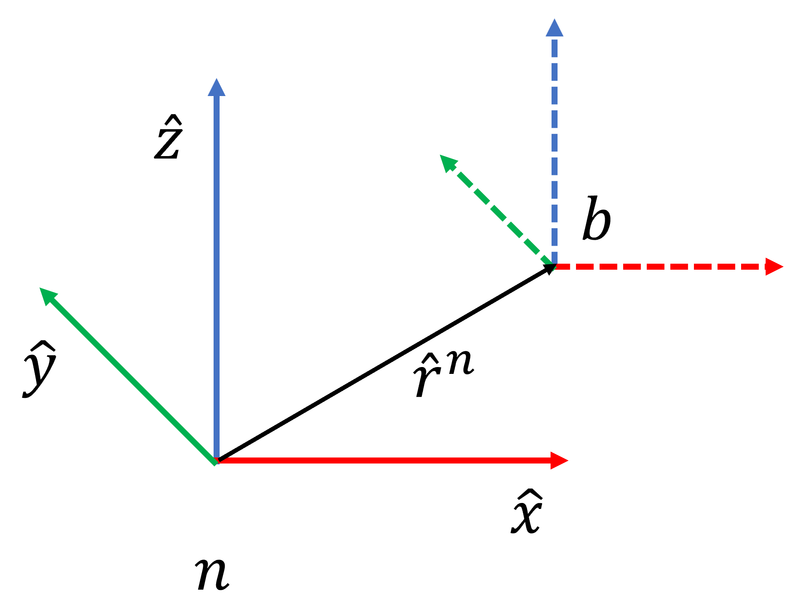

+++
title = 'The physics of multicopter drones'
date = '2024-01-27T19:22:34-06:00'
description = ""
tags = []
categories = []
link = ""
hasequations = true
includes = []       # any javascript files to include
tableofcontents = false
draft = true
+++

This article summarizes the physics governing flight of a drone. It also provides convenient python code for these calculations. This work was adapted from my publication at [IEEE CoDiT 2023](https://ieeexplore.ieee.org/abstract/document/9925862) about [`multirotor`](https://multirotor.readthedocs.io), a python simulation framework for drones. The notation here borrows heavily from the excellent work by [Charles Tytler](https://github.com/charlestytler/QuadcopterSim).

## Describing the vehicle

### Position and Orientation representation

A multi-rotor UAV is modeled with six degrees of freedom: the three spatial coordinates $x, y, z$ and the three Euler angles $\phi, \theta, \psi$.

Two reference frames are used for representing the state of the body:

1. Inertial, nominal reference frame $n$ is the static frame of reference where the axes are aligned with arbitrary, global directions. They are represented as $[\hat{x}, \hat{y}, \hat{z}]$.
2. Body-fixed reference frame $b$ has the axes aligned with respect to the center of gravity of the rigid body in motion. They are represented as $[\hat{b}_1, \hat{b}_2, \hat{b}_3]$. The body frame moves and rotates with the vehicle. Consider the origin of the body frame attached to the center of mass of the drone.



Orientation of a body in the inertial reference frame follows the Tait-Bryan angles convention. That is, orientation can be described by three sequential rotations: yaw ($\psi$), pitch ($\theta$), and roll ($\phi$) - *in that order*. The order of rotations matters. Starting from the inertial frame, yaw $\psi$ is rotation $R(\psi)$ of the body frame about the inertial $z$ axis. Pitch $\theta$ is rotation about the $y$ axis after the first rotation of the inertial frame: $R(\theta)\cdot R(\psi)$. And roll $\phi$ is the final rotation about the $x$ axis of the frame after the prior two rotations. The final product is the body reference frame.


### Reconciling inertial and body frames

Given a vector in the inertial frame $\hat{r}^n=[x,y,z]^T$ and the same vector viewed in the body frame $\hat{r}^b=[b_1,b_2,b_3]^T$, the rotation matrix from the inertial to body reference frames $R_n^b$ is defined as:

$$
\begin{align}
    \hat{r}^b &= R(\phi)\cdot R(\theta) \cdot R(\psi) \cdot \hat{r}^n \\\\
    \hat{r}^b &= R_n^b \hat{r}^n \\\\
    \begin{bmatrix}
    b_1 \\\\
    b_2 \\\\
    b_3
    \end{bmatrix} &= 
    \begin{bmatrix}
    c\theta c\psi & c\theta s\psi & -s\theta \\\\
    -c\phi s\psi + s\phi s\theta c\psi & c\phi c\psi + s\phi s\theta s\psi & s\psi c\theta \\\\
    s\phi s\psi + c\phi s\theta c\psi & -s\phi c\psi + c\phi s\theta s\psi & c\psi c\theta
    \end{bmatrix}
    \begin{bmatrix}
    x \\\\
    y \\\\
    z
    \end{bmatrix}
\end{align}
$$

Here $c | s$ of $\phi | \theta | \psi$ refer to the cosine and sin respectively.

By convention, the right handed coordinate system is followed. The direction of the positive $x$ axis in the body frame ($b_1$) is considered "forward" orientation. The positive $y$ axis ($b_2$) is "left" and the positive $z$ axis ($b_3$) is up. For rotations about each axis, positive rotation is counter-clockwise, looking at the positive rotation axis coming out of the page.

For the body frame with an angular velocity about its axes with respect to the inertial frame $\hat{\omega}=[\omega_x,\omega_y,\omega_z]$, the time-derivative of a vector in a rotating body frame $\hat{\mathcal{V}}^b = \hat{\mathcal{V}} \cdot \hat{b}$ as measured in the inertial frame is given by the Coriolis theorem:

$$
\begin{align}
    \frac{d \hat{\mathcal{V}}^n}{d t} &= \frac{d \hat{\mathcal{V}}}{d t} \cdot \hat{b} + \frac{d \hat{b}}{d t} \cdot \hat{\mathcal{V}} \\\\
    &= \frac{d \hat{\mathcal{V}}}{d t} \cdot \hat{b} + \hat{\omega} \times \hat{\mathcal{V}}^b \\\\
    &= \frac{d \hat{\mathcal{V}}}{d t} \cdot \hat{b} + 
    \begin{bmatrix}
    0 & -\omega_z & \omega_y \\\\
    \omega_z & 0 & -\omega_x \\\\
    -\omega_y & \omega_x & 0
    \end{bmatrix} \hat{\mathcal{V}}
\end{align}
$$

### The state of the vehicle

Tracking the motion of the vehicle requires tracking multiple variables. The variables can be divided into translational and their rotational analogues.

1. $\hat{r}^n=[x,y,z]$ are the navigation coordinates in the inertial frame.
2. $\hat{v^b}=[\dot{x}, \dot{y}, \dot{z}]$ is the velocity of the vehicle along the body frame axes.
3. $\hat{\Phi}=[\phi, \theta, \psi] $ is the orientation of the body reference frame $b$ in Euler angles (roll, pitch, yaw) with reference to the inertial reference frame.
4. $\hat{\omega}=[\omega_x, \omega_y, \omega_z]$ is the roll rate of the three body frame axes with reference to the inertial frame.

The state variables above are affected by the forces and torques acting on the body.

1. $\hat{F}^b=[F_{b_1},F_{b_2},F_{b_3}]$ are the net forces along the three body frame axes, where $\hat{F}^b=R_n^b \hat{F}^n$.
2. $\hat{M}^b=[M_{b_1},M_{b_2},M_{b_3}]$ are the moments along the three body axes, where $\hat{M}^b=R_n^b \hat{M}^n$.

## Dynamics of multi-rotor UAVs

The multirotor is modeled as a rigid body. A rigid body has a constant mass distribution relative to its center of gravity. Fundamental to the dynamics is Newton's second law of motion:

$$
\begin{align}
F = m \cdot a
\end{align}
$$

And its rotational analogue:

$$
\begin{align}
r \times F = r \times  (m \cdot a) \\\\
M = I \cdot \omega
\end{align}
$$

### Equations of motion

The equations of motion relate the state variables the the dynamics of the system. The equations of motion are derived from Newton's second law of motion. Where, for translational variables:

$$
\begin{align}
    \hat{F}^b &= m \frac{d \hat{v}^b}{d t} %= m(\hat{\dot{v}}^b + \hat{\omega} \times \hat{v}^b)
\end{align}
$$

The above relationship can be re-written as using the abstraction provided by the Coriolis force. This will give the force acting on the body according to the inertial frame:

$$
\begin{align}
     \hat{F}^n &= m(\hat{\dot{v}}^b + \hat{\omega} \times \hat{v}^b)
\end{align}
$$

For rotational variables a similar analogue exists. Given $M^b$ is the rotating body-frame moment, $\omega$ is the angular rate measured in the body frame (subject to the Coriolis effect), and $I$ is the moment of inertia:

$$
\begin{align}
    \hat{r}^b \times \hat{F}^b &= m \cdot \hat{r}^b \times \frac{d \hat{v}^b}{d t} \\\\
    \hat{M}^b &= \hat{I}\frac{d \hat{\omega}}{d t} \\\\
    \hat{M}^b &= \hat{I}\hat{\dot{\omega}} + \hat{\omega} \times \hat{I}\hat{\omega}
\end{align}
$$

Note that while force is measured in the inertial frame, moments are measured in the body frame. This is because the state vector tracks inertial position $\hat{r}^n$, and the rotation and orientation of the body frame.

### Linear variables

The linear state variables ($\hat{r}^n$, $\hat{v}^b$) are determined primarily by the forces acting on the vehicle. The force of gravity $\hat{F_g}^n=[0,0,-mg]$ in the nominal reference frame. In the body frame it becomes $\hat{F_g}^b=R^b_n \hat{F}^n$. The net force of the $p$ propellers in the body frame is $\hat{F_p}^b=[0,0,\sum_i^p T_i]$. Thus, the total force acting on the center of mass is $\hat{F}^b=\hat{F_p}^b + \hat{F_g}^b$. Thus solving for acceleration $\hat{\dot{v}}^b$ and equating with the acceleration acting on the body frame $\hat{F}^b / m$ yields the rate of change of velocity $\hat{v}^b$ in the body frame.

Using $R_b^n$ and the current body frame velocity $\hat{v}^b$ gives the rate of change of position $r^n$ in the inertial frame.

### Angular variables

The angular state variables ($\hat{\omega}$, $\hat{\Phi}$) are governed by the moments acting on the body. The moments due to thrust acting on the propeller arm for each propeller are $\hat{M}\_T^b=\sum_i^p r\_i \times T_i$.
The yaw moments about $b_3$ due to the rotation of the motor are given by $\hat{M}\_\tau^b=\sum_i^p \tau_i$. The total moments about the body are $\hat{M}^b=\hat{M}\_T^b+\hat{M}\_\tau^b$. Solving the torque equation for $\hat{\omega}$, and substituting these moments, yields the rate of change of angular rate $\hat{\omega}$ in the body frame.

The rate of change of orientation $\hat{\Phi} = [\dot{\phi}, \dot{\theta}, \dot{\psi}]$ is related to the angular rate $\hat{\omega}$. The angular rate is the instantaneous rotation rate of the body axes. Whereas each angle of orientation is defined in its own reference frame during a sequence of ordered rotations from the inertial axes to the body frame (yaw, pitch, roll). Solving this quation gives the rate of change of orientation.

$$
    \begin{bmatrix}
    p \\\\
    q \\\\
    r
    \end{bmatrix} = R(\phi)\cdot R(\theta) \begin{bmatrix}
        0 \\\\ 0 \\\\ \dot{\psi}
    \end{bmatrix} + 
    R(\phi) \begin{bmatrix}
    0 \\\\ \dot{\theta} \\\\ 0
    \end{bmatrix} + 
    \begin{bmatrix}
    \dot{\phi} \\\\ 0 \\\\ 0
    \end{bmatrix}
$$

The rates of changes of the 12 (linear and angular) state variables can be integrated to track the state of the vehicle.

$$
\begin{align}
\begin{bmatrix}
\dot{\hat{r^n}_1} \\\\
\dot{\hat{r^n}_2} \\\\
\dot{\hat{r^n}_3} \\\\
\\\\
\dot{\hat{v^b}_1} \\\\
\dot{\hat{v^b}_2} \\\\
\dot{\hat{v^b}_3} \\\\
\\\\
\dot{\phi} \\\\
\dot{\theta}\\\\
\dot{\psi} \\\\
\\\\
\dot{\hat{\omega}}
\end{bmatrix} = \begin{bmatrix}
c\_\theta   c\_\psi \hat{v^b}_1 + (-c\_\phi   s\_\psi + s\_\phi s\_\theta c\_\psi)   \hat{v^b}_2 +  (s\_\phi s\_\psi+c\_\phi s\_\theta c\_\psi)   \hat{v^b}_3 \\\\
c\_\theta   s\_\psi   \hat{v^b}_1 + (c\_\phi   c\_\psi+s\_\phi   s\_\theta   s\_\psi)   \hat{v^b}_2 +  (-s\_\phi   c\_\psi+c\_\phi   s\_\theta   s\_\psi)   \hat{v^b}_3 \\\\
(-s\_\theta   \hat{v^b}_1 + s\_\phi   c\_\theta   \hat{v^b}_2 + c\_\phi   c\_\theta   \hat{v^b}_3) \\\\
\\\\
\frac{m}{F_x} + g   s\_\theta          + \omega_3   \hat{v^b}_2 - \omega_2   \hat{v^b}_3 \\\\
\frac{m}{F_y} - g   s\_\phi   c\_\theta   - \omega_3   \hat{v^b}_1 + \omega_1   \hat{v^b}_3 \\\\
\frac{m}{F_z}     - g   c\_\phi   c\_\theta   + \omega_2   \hat{v^b}_1 - \omega_1   \hat{v^b}_2 \\\\
\\\\
\omega_1 + (\omega_2 s\_\phi + \omega_3 c\_\phi)   s\_\theta / c\_\theta \\\\
\omega_2   c\_\phi - \omega_3   s\_\phi \\\\
(\omega_2   s\_\phi + \omega_3   c\_\phi) / c\_\theta \\\\
\\\\
I^{-1} \cdot (\hat{\tau} - \hat{\omega} \times I \cdot \hat{\omega})
\end{bmatrix}
\end{align}
$$

```python
def get_state_change_from_dynamics(
    forces, torques, x, g, mass, inertia_matrix
):
    # Store state variables in a readable format
    xI = x[0]       # Inertial frame positions
    yI = x[1]
    zI = x[2]
    ub = x[3]       # linear velocity along body-frame-x-axis b1
    vb = x[4]       # linear velocity along body-frame-y-axis b2
    wb = x[5]       # linear velocity along body-frame-z-axis b3
    phi = x[6]      # Roll
    theta = x[7]    # Pitch
    psi = x[8]      # Yaw
    p = x[9]        # body-frame-x-axis rotation rate
    q = x[10]       # body-frame-y-axis rotation rate
    r = x[11]       # body-frame-z-axis rotation rate
    
    # Pre-calculate trig values
    cphi = np.cos(phi);   sphi = np.sin(phi)    # roll
    cthe = np.cos(theta); sthe = np.sin(theta)  # pitch
    cpsi = np.cos(psi);   spsi = np.sin(psi)    # yaw

    f1, f2, f3 = forces # in the body frame (b1, b2, b3)
    t1, t2, t3 = torques
    inertia_matrix_inv = np.linang.inv(inertia_matrix)
    
    xdot = np.zeros_like(x)

    # velocity = dPosition (inertial frame) / dt (convert body velocity to inertial)
    xdot[0] = cthe*cpsi*ub + (-cphi * spsi + sphi*sthe*cpsi) * vb + \
        (sphi*spsi+cphi*sthe*cpsi) * wb  # = xIdot 
    xdot[1] = cthe*spsi * ub + (cphi*cpsi+sphi*sthe*spsi) * vb + \
        (-sphi*cpsi+cphi*sthe*spsi) * wb # = yIdot 
    xdot[2] = (-sthe * ub + sphi*cthe * vb + cphi*cthe * wb) # = zIdot

    # acceleration = dVelocity (body frame) / dt
    #           External forces     Gravity             Coriolis effect
    xdot[3] = 1/mass * (f1)     + g * sthe          + r * vb - q * wb  # = udot
    xdot[4] = 1/mass * (f2)     - g * sphi * cthe   - r * ub + p * wb # = vdot
    xdot[5] = 1/mass * (f3)     - g * cphi * cthe   + q * ub - p * vb # = wdot

    # Orientation
    xdot[6] = p + (q*sphi + r*cphi) * sthe / cthe  # = phidot
    xdot[7] = q * cphi - r * sphi  # = thetadot
    xdot[8] = (q * sphi + r * cphi) / cthe  # = psidot

    # Angular rate
    gyro = np.cross(x[9:12], inertia_matrix @ x[9:12])
    xdot[9:12] = inertia_matrix_inv @ (torques - gyro)
    
    return xdot
```

## Generating forces and torques

### Propellers

Given the propeller geometry parameters, the thrust is modeled by numerically solving the equation for thrust and propeller induced velocity. An alternate approach, relating the thrust constant and propeller velocity can be used as well.

$$
\begin{align}
T = k\_{T} \cdot \Omega^2
\end{align}
$$

Torque about the yaw axis is modeled as aerodynamic drag, which is equal to the net BLDC motor torque $\tau\_{BLDC}$ near hover conditions. Given the drag coefficient $k_d$,

$$
\begin{align}
    \tau = k_{d} \cdot \Omega^2
\end{align}
$$

### Motors

The environment models brushless direct current (BLDC) motors independently as sub-objects. Each motor is parameterized by the back electromotive force constant, $k_e$, and the internal resistance $R_{BLDC}$. The torque constant $k_\tau$ is equal to $k_e$ for an ideal square-wave BLDC. $k_\tau$ determines the driving moment of the motor. Dissipative moments are governed by the dynamic friction constant $k_{DF}$, and the aerodynamic drag constant $k_d$. Finally, the net moments $\tau$ and the moment of inertia $J$ of the motor determine how fast the rotor spins. The state of each motor is its angular velocity $\Omega$, applied voltage $v_{BLDC}$, and drawn current $i_{BLDC}$. The dynamics are given by this equation:

$$
\begin{align}
    i_{BLDC} &= (v_{BLDC} - k_e \cdot \Omega ) / R_{BLDC}\\\\
    \tau_{BLDC} &= k_\tau \cdot i_{BLDC} \\\\
    \tau &= \tau_{BLDC} - k_{DF}\cdot\Omega - k_d\cdot\Omega^2 \\\\
    \frac{d \Omega}{dt} &= \tau / J
\end{align}
$$

## Control

Control mixing is the procedure of relating the net dynamics (forces and moments) about the vehicle body $D$, to the rotational speeds of the propellers $\hat{\Omega}$. Due to geometry, the lateral forces on the body from the propeller are zero, thus $F\_{b_2}=F_{b_3}=0$. Moments about $b_1$ and $b_2$ are determined by the moment arm $r_{arm}$ and thrust $r\_{arm} \times T$. Yaw moments about $b_3$ are determined by the torque equation. Putting these relationships together yields the control allocation matrix, and a system of equations linear in $\Omega^2$. Thus, the prescribed dynamics $D$ from the controller can be converted to the prescribed propeller speeds $\Omega$ for each motor:

$$
\begin{align}
    \begin{bmatrix}
    F_{b_1} \\\\
    F_{b_2} \\\\
    F_{b_3} \\\\
    M_{b_1} \\\\
    M_{b_2} \\\\
    M_{b_3}
    \end{bmatrix}
    &=  \underset{6 \times 1}{D} = \underset{6 \times p}{A} \cdot \underset{p \times 1}{\hat{\Omega}^2} \\\\
    \hat{\Omega} &= \sqrt{A^{-1} \cdot D}
\end{align}
$$

For a propeller $p$ with a thrust coefficient $k\_{th,p}$, a drag coefficient $k\_{dr,p}$, at a radius $r_p$ from the center of mass and angle $\theta_p$ from the reference forward direction in the vehicle's frame of reference, and where propellers are alternatively spinning clockwise and counter-clockwise,

$$
\begin{align}
    A = \begin{bmatrix}
        \cdots & k\_{th,i} & \cdots \\\\
        \cdots & k\_{th,i} \cdot r\_p \sin(\theta_i) & \cdots \\\\
        \cdots & k\_{th,i} \cdot r\_p \cos(\theta_i) & \cdots
    \end{bmatrix}
\end{align}
$$

A cascaded PID controller is implemented for position and attitude tracking. A supervisory position PID controller tracks measured lateral velocities and outputs the required pitch and roll needed to reach a specified way-point. A lower-level attitude controller then tracks the pitch, roll, and yaw velocities and outputs the required torques. In parallel, a PID controller tracks vertical velocity and outputs the thrust needed. The eventual output of the cascaded PID setup is the prescribed thrust, and the roll, pitch, and yaw torques. These prescribed dynamics are then allocated via control mixing to the motors.

The standard control logic flow of UAVs is depicted in the following figure. In this standard end-to-end approach, the position reference is converted into propeller speed signals


The cascaded PID controller converts position/yaw references into the desired dynamics (forces and torques, $F_z,\tau_x,\tau_y,\tau_z$) to achieve that reference position and yaw. The control output $u\_{PID}$ aims to minimize the input error $e=\texttt{reference}-\texttt{measurement}$ with respect to the reference and measured states.:

$$
\begin{align}
    u\_{PID} = k_p e + k_d \nabla_t e + k_i \int_0^t e \partial t
\end{align}
$$